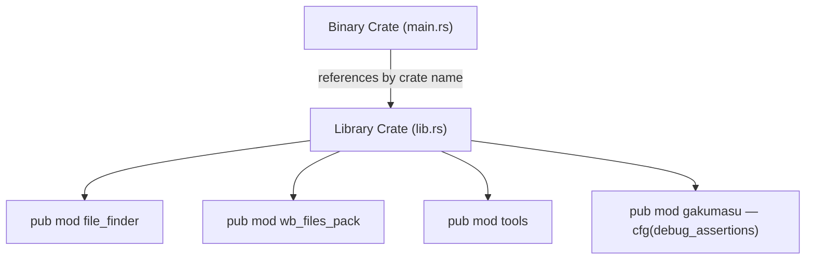
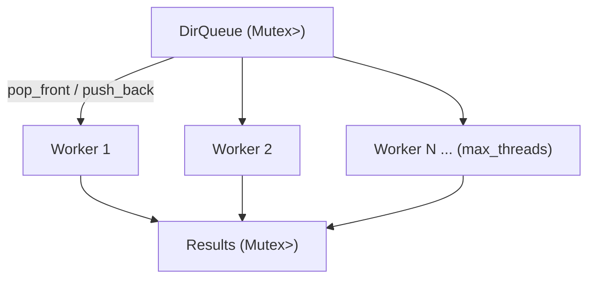
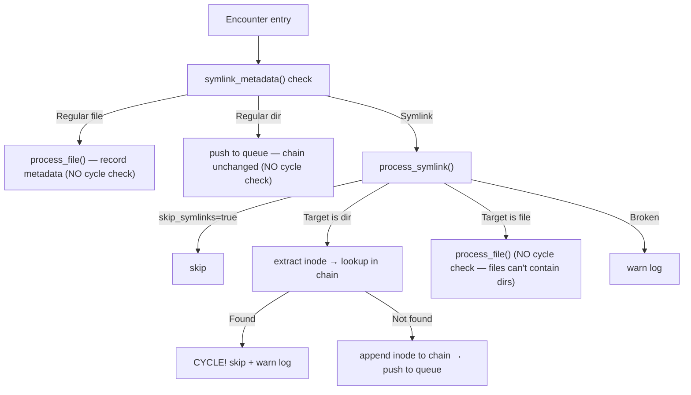
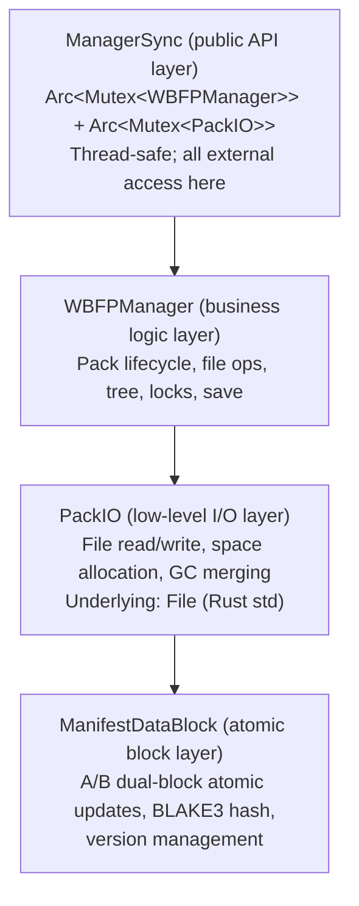
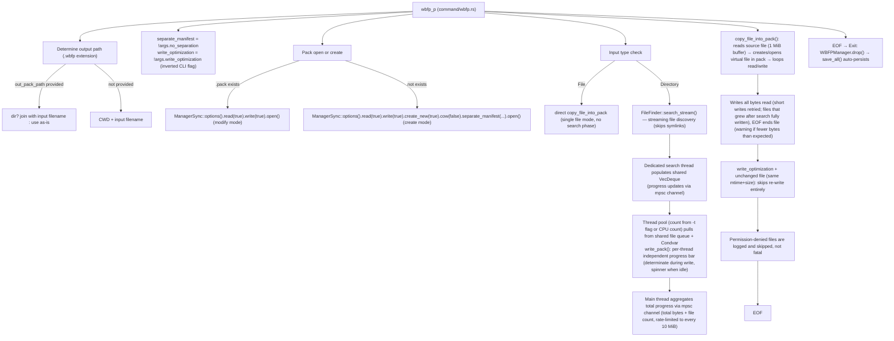
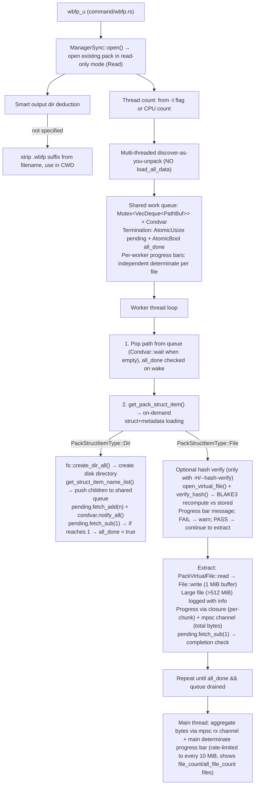
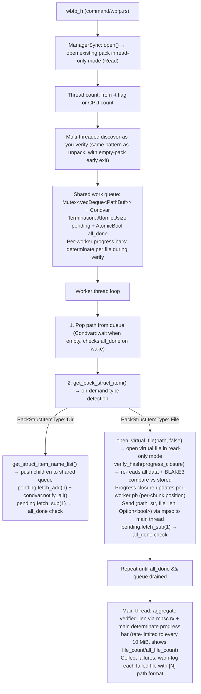
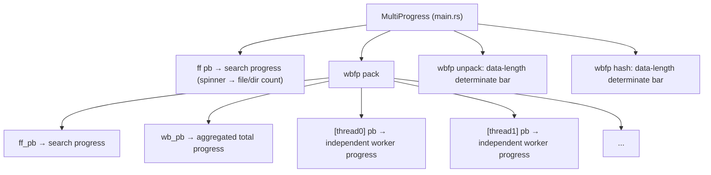
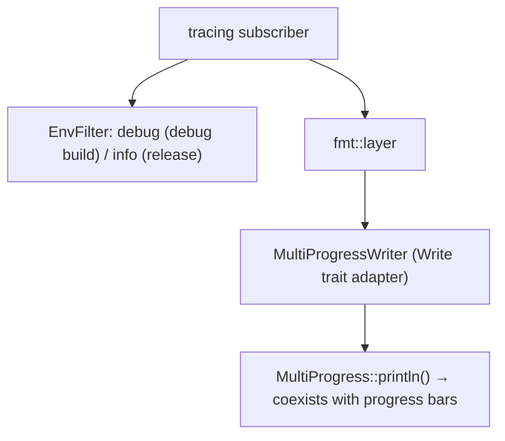

# WaterBall Tool — Architecture
> **Language**: English | [简体中文](docs/zh_CN/ARCHITECTURE.md)

> Last Updated: 2026-07-29

---

## Table of Contents

1. [Overview](#1-overview)
2. [Tech Stack](#2-tech-stack)
3. [Module Dependency Graph](#3-module-dependency-graph)
4. [Binary vs Library Crate](#4-binary-vs-library-crate)
5. [Entry Point & CLI Routing](#5-entry-point--cli-routing)
6. [File Finder (`ff`)](#6-file-finder-ff)
7. [WaterBall Files Pack (`wbfp`)](#7-waterball-files-pack-wbfp)
8. [Progress Bar System](#8-progress-bar-system)
9. [Logging System](#9-logging-system)
10. [Tools Module](#10-tools-module)
11. [Work-in-Progress Modules](#11-work-in-progress-modules)
12. [Test Architecture](#12-test-architecture)
13. [Design Decisions & Tradeoffs](#13-design-decisions--tradeoffs)

---

## 1. Overview


WaterBall Tool is a multi-purpose CLI toolkit written in **Rust (edition 2024)**. It currently provides two core features:

- **`ff`** — Multi-threaded parallel file finder, emits a JSON file manifest with symlink cycle detection
- **`wbfp`** — Custom binary archive format (WaterBall Files Pack): pack, unpack, and BLAKE3 hash verification

The project follows the standard Rust **binary crate + library crate** split: the binary crate handles CLI entry, the library crate exposes reusable modules.


> Portions generated by AI (deepseek-v4-pro), delimited by `//AI===` / `//AI_END===`.

---

## 2. Tech Stack


|  Category  |  Crate  |  Purpose  |
| --- | --- | --- |
|  CLI  |  `clap 4.6` (derive)  |  Argument parsing  |
|  Serialization  |  `serde` / `serde_json`  |  Data structures, JSON output  |
|  Hashing  |  `blake3 1.8`  |  File data integrity  |
|  Progress bars  |  `indicatif 0.18`  |  Terminal spinners & progress bars  |
|  Logging  |  `tracing` / `tracing-subscriber`  |  Structured logging (env-filter)  |
|  Process detection  |  `sysinfo 0.39`  |  PID liveness check for lock files  |
|  Random  |  `rand 0.10`  |  Randomized test data (longtime tests: random tree search stress, large fixtures)  |
|  Test utils  |  `pretty_assertions 1.4`  |  Diffable assertion output  |

---

## 3. Module Dependency Graph


```
main.rs (binary)
  ├── command.rs          ← CLI routing
  │   ├── command/ff.rs   ← ff subcommand
  │   ├── command/wbfp.rs ← wbfp subcommand
  │   └── command/test.rs ← integration tests
  └── depends on:
      water_ball_tool (library crate)
        ├── file_finder.rs          ← file search core
        │   └── file_finder/test.rs ← symlink tests
        ├── wb_files_pack.rs        ← WBFP module root
        │   ├── data.rs             ← core data types (1762 lines, largest module)
        │   ├── error.rs            ← error types
        │   ├── manager.rs          ← WBFPManager
        │   │   ├── open.rs         ← create/open pack files
        │   │   ├── save.rs         ← progressive save + throttling
        │   │   ├── file_ops.rs     ← virtual file creation + dir creation
        │   │   ├── tree.rs         ← directory tree traversal + lazy loading
        │   │   ├── metadata.rs     ← file handle creation + metadata update
        │   │   ├── lock.rs         ← process-level write lock
        │   │   ├── gc.rs           ← GC orchestration
        │   │   ├── delete.rs       ← virtual file/dir delete + erase
        │   │   └── test.rs         ← internal API tests
        │   ├── manager_sync.rs ← public API layer (Arc<Mutex<>>)
        │   │   └── test.rs         ← public API tests
        │   ├── pack_io.rs          ← low-level file I/O + space allocation + GC merging
        │   │   │
        │   │   ├── file.rs         ← PackVirtualFile (virtual file handle with access mode enforcement)
        │   │   ├── file_handle.rs  ← PackFileHandle (493 lines, core file logic)
        │   │   └── file_hash.rs    ← PackFileHash (BLAKE3 state machine)
        │   ├── net_server.rs       ← network server (WIP)
        │   └── test.rs             ← module-level tests
        ├── tools.rs                ← path utilities + byte formatting
        └── gakumasu/              ← game simulator (WIP)
            ├── data.rs
            └── simulator.rs
```

---

## 4. Binary vs Library Crate


```
src/main.rs       → binary crate   "water_ball_tool"
src/lib.rs        → library crate  "water_ball_tool"
```

**Key Rules**

- `main.rs` declares `mod command;` — `command.rs` is **private** to the binary crate
- `command.rs` references library code via crate-name-qualified paths — `water_ball_tool::file_finder`, `water_ball_tool::wb_files_pack` — **not** `crate::file_finder`
- `lib.rs` exports public modules: `file_finder`, `wb_files_pack`, `tools`, `gakumasu` (gated under `#[cfg(debug_assertions)]` — only compiled in debug builds)

**Dependency Flow**



---

## 5. Entry Point & CLI Routing


### `main.rs` — Entry Point (81 lines)

```
1. Cli::parse()       — clap derive parses CLI args
2. MultiProgress::new() — global progress bar container
3. init_global_logging(&mp) — initializes tracing subscriber
4. command::cli(cli, &mp) — routes to subcommand
```

**Key design**: `MultiProgressWriter` adapts `tracing` output into `io::Write` via `MultiProgress.println()`, preventing log-progress-bar visual conflicts. Log level: `debug` in debug mode, `info` in release, gated by `#[cfg(debug_assertions)]`.


### `command.rs` — CLI Routing (121 lines)

```rust
Cli {
    command: Commands::Ff(FileFinderArgs) | Commands::Wbfp(WaterBallFilePackArgs)
}
```

Progress bar helpers

|  Function  |  Purpose  |
| --- | --- |
|  `create_pb(mp)`  |  Create spinner (indeterminate progress)  |
|  `set_pb_style2(pb, data_len)`  |  Switch to determinate bar mode (`=>-` chars)  |
|  `update_pb(cb, ...)`  |  Rate-limited update: fires every 10×BUF_LEN bytes  |

Constants

|  Constant  |  Value  |  Purpose  |
| --- | --- | --- |
|  `BUF_LEN`  |  1 MiB  |  Read/write buffer size  |
|  `PROGRESS_STYLE_TEMPLATE`  |  —  |  Search progress bar template  |
|  `PACK_PROGRESS_STYLE_TEMPLATE`  |  —  |  Pack/unpack progress bar template (with prefix, percent, bytes)  |

---

## 6. File Finder (`ff`)

### 6.1 Multi-Threaded Work Queue Model


Architecture: **shared work queue + condition variable** pattern.



**Worker lifecycle**

1. On spawn: `running_count` incremented
2. Loop: `pop_front()` from queue
3. Queue empty: `running_count` decremented, check if zero
   - `running_count == 0` → `condvar.notify_all()`, thread exits
   - Otherwise → `condvar.wait()`, recheck on wake
4. Woken: `running_count` incremented, process popped task

**Progress rate limiting**: fires every 50 files / 10 dirs via `pb.send((delta_files, delta_dirs))`.


### 6.2 Symlink Cycle Detection


Each worker thread maintains an independent **inode chain** (`Vec<InodeKey>`) carried by `DirEntry`:


```rust
struct DirEntry {
    path: PathBuf,
    symlink_chain: Vec<InodeKey>,  // inodes of dirs entered via symlinks on this path
}                                  /
```

**Detection flow**



**Platform differences**

|  Platform  |  InodeKey type  |  Extraction method  |
| --- | --- | --- |
|  Unix  |  `u128`  |  `(dev << 64) \| ino`  |
|  Windows  |  `PathBuf`  |  `canonicalize()` fallback to original path  |

> **Rationale**: Regular directories cannot form cycles in a normal filesystem; only symlinks can close a loop. This keeps the detection mechanism scoped exactly where it matters, with zero overhead on normal files and directories.

### 6.3 Core Data Structures


```rust
pub struct FilesList {
    path: String,                            // Root search path
    data_length: u64,                        // Total data size
    file_count: u64,                         // File count (excl. dirs)
    dir_count: u64,                          // Directory count
    files_list: HashMap<String, FileInfo>,   // Direct children of root
}

pub struct FileInfo {
    name: String,           // Name (without path)
    length: u64,            // File=actual size, Dir=cumulative child total
    modified_time: u128,    // ms since UNIX epoch
    file_kind: FileKind,
}

pub enum FileKind {
    File,                   /
    Dir(Dir),               /
}

pub struct Dir {
    files_list: HashMap<String, FileInfo>,  // Direct children
    file_count: u64,                        // Cumulative descendant file count
    dir_count: u64,                         // Cumulative descendant dir count
}
```

### 6.4 Streaming Search API


| Feature | `search()` | `search_stream()` |
|---|---|---|
|  `FilesList` tree  |  `(JoinHandle, Receiver<(PathBuf, FileInfo)>)`  |
|  `HashMap` (in-memory)  |  None — zero overhead
|  Blocking, one-shot
|  `ff` command  |  `wbfp` pack (producer-consumer)  |
|  `Some(results)`  |  `None` (skips HashMap

### 6.5 Tree Rebuilding


Parallel scan produces a flat `HashMap<PathBuf, FileInfo>`. `build_tree()` reconstructs the nested `FilesList`:


1. Group all entries by parent path → `HashMap<PathBuf, Vec<PathBuf>>`
2. Iterative stack-based post-order build (Pre/Post state machine with explicit `Fr` frames) — avoids stack overflow on deeply nested hierarchies; parent-child linkage uses `rposition()` backward search for correct path matching
3. Directory `length` = sum of all descendant file sizes
4. Directory `file_count`/`dir_count` = cumulative across all subdirectories

---

## 7. WaterBall Files Pack (`wbfp`)


**Files**: `src/wb_files_pack/*.rs` (~6,000+ lines total)

### 7.1 Overall Architecture


WBFP uses a **three-layer architecture**



### 7.2 Binary Format


Full specification at `docs/en_US/wb_files_pack/manifest-data.md`. Summary:


```
.pack file layout
┌────────────────────────────────────────────────────────┐
│  FILE_HEADER_BLOCK_LEN (128 + attribute block)         │
│  ├─ File header: magic "WBFilesPack", ver [0,2]        │
│  │   ├─ type_name (11B)                                │
│  │   ├─ version (2B)                                   │
│  │   ├─ bool_data (1B) — cow bit[0], s_manifest bit[1] │
│  │   ├─ pack_len (8B)                                  │
│  │   └─ padding to 128B                                │
│  └─ Embedded Attribute manifest data block             │
├────────────────────────────────────────────────────────┤
│  Data Region                                           │
│  ├─ File data blocks (DATA_DATA_BLOCK_LEN-aligned)     │
│  └─ (optional) manifest data (when !separate_manifest) │
├────────────────────────────────────────────────────────┤
│  Manifest Index                                        │
│  ├─ DataPosList (data free region list)                │
│  ├─ DataPosList (manifest free list, separated only)   │
│  ├─ PackStruct (root directory)                        │
│  │   └─ PackStructItem ... (recursive)                 │
│  └─ PackFileMetadata ... (per file/dir)                │
└────────────────────────────────────────────────────────┘
```

**Key Constants**

|  Constant  |  Value  |  Purpose  |
| --- | --- | --- |
|  `DATA_BLOCK_LEN`  |  128 B  |  Manifest data alignment unit  |
|  `DATA_DATA_BLOCK_LEN`  |  4 MiB  |  File data allocation unit  |
|  `MANIFEST_VERSION`  |  10  |  Current manifest format version  |
|  `MANIFEST_VERSION_COMPATIBLE`  |  10  |  Minimum compatible version  |

### 7.3 Core Data Structures


```rust
/// Top-level manifest
pub struct WBFilesPackManifest {
    attribute: Attribute,         // Global attributes (always resident)
    root_struct: PackStruct,      // Root directory structure
    file: Option<PackIO>,         // Manifest file I/O (separated mode)
}

/// Global attributes — pack file metadata
pub struct Attribute {
    version: u16,                              // Format version
    version_compatible: u16,                   // Compatible version
    cow: bool,                                 // Copy-on-write
    empty_data_pos_list_pos: u64,              // Data free-list position
    manifest_empty_data_pos_list_pos: u64,     // Manifest free-list position
    manifest_file_len: u64,                    // Manifest file length
    root_struct_pos: u64,                      // Root struct position
    file_count: u64,                           // Total files
    dir_count: u64,                            // Total dirs
    data_len: u64,                             // Total data size
    data_block: ManifestDataBlock,
    dirty: bool,                               // Dirty flag
}

/// Directory structure node
pub struct PackStruct {
    items: HashMap<String, PackStructItem>,    // Children
    data_block: ManifestDataBlock,
    dirty: bool,
}

/// Directory entry
pub struct PackStructItem {
    name: String,
    metadata_file_pos: u64,                    // Metadata position
    item_type: PackStructItemType,
    metadata: PackFileMetadataRun,             // State machine
}

pub enum PackStructItemType {
    File { handle: Option<Weak<Mutex<PackFileHandle>>> },
    Dir { struct_file_pos: u64, pack_struct: Option<PackStruct> },
}

/// Metadata state machine — controls access lifecycle
pub enum PackFileMetadataRun {
    None,                                       // No metadata
    NoLoad,                                     // Not yet loaded
    Loaded(Box<PackFileMetadata>),              // Ready for use
    Locked,                                     // Write in progress
}

pub enum PackFileMetadataType {
    File {
        hash_type: u8,                          // 1 = BLAKE3
        hash_value: Vec<u8>,                    // Hash value
        data_pos_list: DataPosList,             // Allocated block positions
    },
    Dir {
        file_count: u64,                        // Cumulative child file count
        dir_count: u64,                         // Cumulative child dir count
    },
}

/// Dual-purpose position list
///   PackIO.empty_data_list  → tracks FREE (reusable) regions
///   PackFileMetadata.data_pos_list → tracks ALLOCATED blocks
pub struct DataPosList {
    data_block: Option<ManifestDataBlock>,
    list: Vec<(u64, u64)>,                      // (position, length) pairs / (
}
```

### 7.4 Manifest Data Block — A/B Dual-Block Mechanism


**File**: `src/wb_files_pack/data.rs` (1762 lines — the largest single module)

All index data (Attribute, PackStruct, PackFileMetadata, DataPosList) is stored in `ManifestDataBlock` instances.


**A/B block structure**

```
┌──────── A Block ────────┬──────── B Block ────────     ┐
│ len(8) │ ver(4) │ hash(8) │ data(...) │ ver(4) │ ...   │
└─────────────────────────┴─────────────────────────     ┘
──────────────────────────────────────────────────────────
        Entire block = aligned to multiples of DATA_BLOCK_LEN (128B)
```

**Atomic update flow**

1. Read both half-blocks, extract version numbers from each
2. Write to the half-block with the **lower** version (`ver + 1`)
3. The other half-block remains untouched
4. Crash after partial write → at least one complete version survives

**Read flow**

1. Check A-block head-tail version match (fast integrity check)
2. Check B-block the same way
3. Pick the half with the higher version that passes validation

**Block size calculation**

```
block_len = ceil((24 + data_len) × 2 / DATA_BLOCK_LEN) × DATA_BLOCK_LEN
```

**Version wrapping**

```rust
fn next_ver(ver: u32) -> u32 {
    if ver == u32::MAX { 1 } else { ver + 1 }
}

// Uses wrapping subtraction to correctly handle u32 rollover
fn ver_is_older(a: u32, b: u32) -> bool {
    a != b && b.wrapping_sub(a) < a.wrapping_sub(b)
}
```

### 7.5 Space Allocation & Garbage Collection


**Core file**: `src/wb_files_pack/pack_io.rs` (402 lines) — PackIO layer

**Space allocation `get_file_pos(length)`**

```
1. Align length to DATA_BLOCK_LEN (128B) boundary
2. Try free list first (empty_data_list):
   └─ Exact match → remove from list, return
   └─ Larger than needed → split: allocate front, keep remainder
3. No suitable free block → extend file: return (file.len, length)
```

**Data allocation**
  Pass 1
  `get_pos_contiguous`
  `MAX_DATA_SEGMENTS`(16)
- Known size (`alloc_size(Some(len))`, e.g. length known from search) allocates
  exactly at 128B alignment via `get_file_pos`, matching the pack's global
  alignment rule with no waste. Unknown size (`alloc_size(None)`, default)
  allocates via 4MiB-aligned `get_data_file_pos_multi` (initial `create_file_raw`)
  reusing free fragments first: Pass 1 single-block first-fit (`get_pos_gc`) →
  Pass 2 contiguous chain of physically adjacent fragments (`get_pos_contiguous`)
  → Pass 3 largest-first accumulation (`get_pos_biggest`); the `empty_data_list`
  order is never changed; extend-file fallback when fragments are insufficient.
  Segments are counted against the virtual file's data segment list
  (`data_pos_list` existing + new), capped at `MAX_DATA_SEGMENTS` (16); over-limit
  allocations are rejected with an error (no partial writes). Fragments are
  batch-sorted and merged into `empty_data_list` by `file_gc` (during `save_all`)
  before they participate in reuse. `alloc_size` is ignored when opening an
  existing file (never shrinks an existing allocation). Manifest data always
  uses 128B-aligned `get_file_pos`.

**Garbage collection**

```
Stage 1 — Staging (file_gc_add):
   ├─ PackFileHandle drops → manager → file_gc_add buffers into gc_data_pos_list

Stage 2 — Merging (file_gc):
   ├─ Append staging items to empty_data_list, then batch sort_unstable_by_key(pos)
   │  O((K+M) log(K+M))
   │  batch sort replaces the previous insertion sort
   ├─ Single-pass merge adjacent: pos1 + len1 == pos2 → merge into one block
   └─ Write updated empty data list
```

**GC trigger points**

- `WBFPManager.save_all()` → `file_gc()` + `manifest_file_gc()`
- File resize-down or overwrite → `PackFileHandle::commit_data()` on drop

### 7.6 Progressive Save


**File**: `src/wb_files_pack/manager/save.rs` (200 lines)

**Throttling condition `throttled_save()`**

```rust
// Trigger save_all() when:
if all_write_len - last_all_write_len > 64 * 1024 * 1024  // 64MiB written
   || all_cr_file_count - last_all_cr_file_count > 10_000  // or 10K files added
```

**`save_all()` flow**

1. `file_gc()` — data region garbage collection
2. `manifest_file_gc()` — manifest file garbage collection
3. `save_root_pack_struct()` — persist root struct (dirty-checked)
   - Also calls `save_manifest_attribute()` if dirty
4. `save_pack_length()` — update pack_len in file header

**Dirty flag chain**

`save_all()` (visibility: `pub(crate)`) is also invoked in `WBFPManager.drop()` — data is always persisted on process exit (unless panicking).


### 7.7 Process-Level Write Lock


**File**: `src/wb_files_pack/manager/lock.rs` (134 lines)

```
Flow
1. Create .lock file, write current PID as little-endian u32
2. sync_all() — ensure persistence
3. File::lock() — acquire OS-level exclusive lock
4. On process exit (Drop): file.unlock() + delete .lock file
```

**Lock detection `write_lock_info()`**

- Read PID from `.lock` file
- `sysinfo::System::new_all()` → check if PID is alive
- PID not alive → panic with message suggesting manual lock file removal
- `.lock` is a directory or symlink → error (abnormal state)

### 7.8 Public API Layer — ManagerSync


| **File**: `src/wb_files_pack/manager_sync.rs` (438 lines)

`ManagerSync` is the thread-safe wrapper around `WBFPManager` + `PackIO`:


```rust
#[derive(Clone)]
pub struct ManagerSync {
    access_mode: PackAccessMode,  // Enforces read/write/read-write at open time
    manager: Arc<Mutex<WBFPManager>>,
    pack_io: Arc<Mutex<PackIO>>,
}
```

**Public API surface**

|  Category  |  Methods  |  Purpose  |
| --- | --- | --- |
|  **Open/Create**  |  `open(path)`  |  Read-only open existing pack  |
|   |  `create_new(path)`  |  Create new pack (defaults from PackOpenOptions), fail if exists  |
|   |  `options() -> PackOpenOptions`  |  Full builder: `read()`/`write()`/`create()`/`create_new()`/`cow()`/`separate_manifest()`  |
|  **Virtual**  |  `open_virtual_file(path, end_pos)`  |  Read-only open existing virtual file  |
|   |  `create_virtual_file(path)`  |  Write-only create new virtual file  |
|   |  `virtual_file_options() -> VirtualFileOpenOptions`  |  Builder: `read()`/`write()`/`create_new()`/`end_pos()`/`alloc_size()`  |
|  **Read**  |  `get_manifest_attribute` / `get_root_struct_items` / `get_dir` / `load_all_data`  |   |
|  **Write**  |  `create_dir_all` / `delete_file` / `delete_dir_all`  |   |
|  **Delete**  |  `delete_file` / `delete_dir_all`  |  Remove metadata + structure, GC data blocks (no overwrite)  |
|  **Erase**  |  `erase_file(strategy)` / `erase_dir_all(strategy)`  |  Overwrite data + manifest blocks → GC → remove  |
|  **Verify**  |  `verify_all_file_hash`  |  Recursively hash-verify all files  |

**Overwrite strategies**

|  Strategy  |  Passes  |  Description  |
| --- | --- | --- |
|  `Zero`  |  1  |  Single pass of 0x00  |
|  `Random`  |  1  |  Single pass of random bytes  |
|  `Dod5220`  |  3  |  DoD 5220.22-M: 0x00 → 0xFF → random (each pass written to disk)  |

> `child_locked_count` on `PackStruct` tracks how many descendant files have active write handles. A directory can only be deleted/erased when `child_locked_count == 0`.

**Design notes**

- `Arc<Mutex<>>` for thread safety — multiple `PackVirtualFile` instances can operate concurrently
- Every method acquires the manager lock → serialized access
- `ManagerSync` is `Clone` — multiple holders share the same pack reference

### 7.9 Virtual File I/O — PackVirtualFile + PackFileHandle


**PackVirtualFile** (`pack_io/file.rs`, 210+ lines) — renamed from `PackFileWR`:

- Implements `Read + Write + Seek` traits with **access mode enforcement**
- Holds `Arc<Mutex<PackFileHandle>>`
- Tracks `pos` (current read/write position) + `AccessMode` (Read/Write/ReadWrite)
- All operations delegated to `PackFileHandle`
- Opened via `VirtualFileOpenOptions` builder pattern (std::fs::File-compatible)
- `get_len()` returns `u64` (not `Result<u64>`); `get_modified()` returns `u128` (not `Result<u128>`) — internal lock acquisition no longer produces a recoverable error
- Mutex poison recovery uses `std::sync::PoisonError::into_inner` throughout

**PackFileHandle** (`pack_io/file_handle.rs`, 493 lines — the most complex single file

```
Responsibilities
    1. Virtual file position management (sparse file support)
    2. Allocation: DataPosList-managed (position, length) list
    3. set_len: grow → auto-allocate new blocks; shrink → release excess → GC
    4. write: map virtual position → real file offset → pack_io.write
    5. read:  map virtual position → real file offset → pack_io.read
    6. commit_data (Drop): compute hash → write back metadata → release pre-allocated space

```

**Position mapping cache**: `temp_pos_index` + `temp_pos_this_len` avoids traversing the entire DataPosList on every read/write.


**Drop behavior**: `PackFileHandle.drop()` auto-invokes `commit_data()`:

1. Compute and persist file hash
2. Release pre-allocated but unused space (via `set_len(metadata_len)`)
3. Return metadata to `WBFPManager.file_metadata_update()`

### 7.10 Hash System


**File**: `src/wb_files_pack/pack_io/file_hash.rs` (81 lines)

```rust
enum PackFileHash {
    None,
    Blake3 { hasher: Box<Hasher>, hash_value: Vec<u8> },
}
```

- Type 0: `None` (directory type)
- Type 1: `Blake3` (file type)
- `update()` — incremental hash update
- `get_hash_value()` — finalize hash
- `eq()` — compare with stored hash value

**Hash verification triggers**

- Pack/write: `PackFileHandle.commit_data()` → `read_hash_v()` recomputes on close
- Unpack/read: `PackVirtualFile::verify_hash()` optional pre-read check
- CLI: `wbfp h` command traverses all files

### 7.11 Error Types


**File**: `src/wb_files_pack/error.rs` (67 lines)

```rust
pub enum PackFileError {
    Io(std::io::Error),
    Lock(String),
    Integrity(String),
    Format(String),
    NotFound(String),
    NotADirectory(String),
    PermissionDenied(String),
    Version(String),
    State(String),
    Other(String),
}
```

- `From<std::io::Error>` → enables `?` operator
- `From<PackFileError> for std::io::Error` → enables Read/Write/Seek trait impls
- Bilingual `Display` messages (Chinese + English) using inline format variables `{e}`, `{msg}` — no redundant `format!` calls

### 7.12 Pack Flow




### 7.13 Unpack Flow




### 7.14 Hash Verify Flow




---

## 8. Progress Bar System


**Core design**: `indicatif::MultiProgress` manages all child progress bars, supports concurrent multi-threaded updates.


**Hierarchy**



**Progress bar modes**

|  Mode  |  Template  |  Use case  |
| --- | --- | --- |
|  Spinner  |  `{spinner} {msg} ({pos})`  |  Unknown-total search  |
|  Determinate  |  `PROGRESS_STYLE_TEMPLATE` (`=>-` chars)  |  Known-total pack  |
|  Determinate+  |  `PACK_PROGRESS_STYLE_TEMPLATE` (percent, bytes)  |  Unpack, hash verify  |

**Rate limiting**: `update_pb()` fires every 10×BUF_LEN (10 MiB) to avoid excessive UI refresh.


---

## 9. Logging System


**File**: `src/main.rs` — `init_global_logging`



**Key design**: `MultiProgressWriter` redirects `tracing` output through `MultiProgress.println()`, eliminating visual overlap between logs and progress bars in the terminal.


---

## 10. Tools Module


**File**: `src/tools.rs` (108 lines)

|  Function/Type  |  Purpose  |
| --- | --- |
|  `PathTool::path_to_string_vec`  |  Split path into string segments, excluding root separator  |
|  `PathTool::path_remove_head`  |  Strip head prefix from path to get relative path  |
|  `bytes_len_to_string(len)`  |  Format byte count as B / KiB / MiB / GiB (2 decimal places)  |
|  `TestTool::remove_test_pack_files`  |  Clean up `.pack`, `.wbm`, `.lock` files after tests  |

---

## 11. Work-in-Progress Modules


### gakumasu (Game Simulator

**Files**: `src/gakumasu/data.rs` (116 lines), `src/gakumasu/simulator.rs` (10 lines)

- Gated behind `#[cfg(debug_assertions)]` — only compiled in debug builds
- Not wired into CLI
- Defines card system types (skill cards, field effect cards), attribute system, effect conditions
- Chinese naming conventions (Gakuen Idolmaster Japanese terminology)
- `simulator.rs` has an empty `GameSimulator` struct and `GameRunning` runtime state

### net_server (Network Server

**File**: `src/wb_files_pack/net_server.rs` (27 lines)

- Gated behind `#[cfg(debug_assertions)]` — only compiled in debug builds
- `WBFPServer` skeleton: manages `HashMap<String, ManagerSync>` for multiple packs
- `WBFPServerClient` skeleton: single client connection
- No network listener logic yet

---

## 12. Test Architecture


|  File  |  Type  |  Coverage  |
| --- | --- | --- |
|  `command/test.rs`  |  Integration  |  ff + wbfp commands, cross-platform symlink cycle detection, synthetic fixture longtime tests (1000 random files via `rand`)  |
|  `file_finder/test.rs`  |  Unit  |  Symlink discovery, ancestor cycles, multi-level, broken, mixed, chain propagation, search_stream  |
|  `wb_files_pack/test.rs`  |  Module  |  Pack file create, read/write, verify  |
|  `wb_files_pack/manager/test.rs`  |  Internal API  |  Manager internal logic  |
|  `wb_files_pack/manager_sync/test.rs`  |  Public API  |  Delete + erase (11 tests), file create/rw/reopen, cow, hash verify, threaded access  |

**Testing conventions**

- Slow tests marked `#[ignore = "longtime"]`, skipped via `cargo test` (
- Test temp dir: `./temp/test/` (gitignored)
- Tests using `indicatif::MultiProgress` must call `crate::init_global_logging(&mp)` first
- `TestTool::remove_test_pack_files(path)` for pack file test cleanup
- Cross-platform tests use `#[cfg(unix)]` / `#[cfg(windows)]` for compilation gating

---

## 13. Design Decisions & Tradeoffs


### File Finder

|  Decision  |  Rationale  |
| --- | --- |
|  Per-thread inode chain (not global map)  |  Simpler, lock-free; cycles are rare and usually on a single path  |
|  Flat HashMap + post-scan tree rebuild  |  More efficient than maintaining nested tree during scanning  |
|  No cycle check on regular files/dirs  |  Filesystem cannot form cycles with normal directories; detection only needed for symlinks  |
|  Windows uses PathBuf as InodeKey  |  Cannot reliably get (dev, ino) on Windows; canonicalize as best approximation  |

### WBFP

|  Decision  |  Rationale  |
| --- | --- |
|  A/B dual-block instead of WAL  |  Simpler implementation; no separate log file or replay logic  |
|  BLAKE3 truncated to 8 bytes  |  Storage-constrained; collision probability negligible at 8 bytes  |
|  PackIO implements both Read+Write  |  Centralized I/O; easy separated/embedded mode switching  |
|  Separate manifest on by default  |  Core pack file needs no modification, reducing corruption risk  |
|  Lazy directory structure loading  |  Avoids parsing entire pack on open; load-on-demand  |
|  Progressive (throttled) save  |  Prevents data loss from power failure during long pack ops  |
|  PID lock file + sysinfo  |  More reliable than pure file locks; detects stale locks  |
|  `Arc<Mutex<>>` instead of Actor model  |  Simpler implementation; direct state sharing, no message passing  |
|  PackFileHandle commits on Drop  |  Guarantees persistence even if caller forgets to close  |
|  `child_locked_count` per PackStruct  |  Directory safety: inc on file handle creation, dec on unlock; delete/erase blocked when > 0  |
|  Delete vs Erase as separate APIs  |  Delete is fast (metadata-only I/O, GC data without overwrite); Erase overwrites every byte on disk before removal  |
|  DoD 5220 writes each pass to disk  |  All three passes (0x00, 0xFF, random) perform independent disk writes — not just in-memory buffer churn  |

### Overall

|  Decision  |  Rationale  |
| --- | --- |
|  Binary + library crate split  |  CLI-only code stays in binary crate; reusable logic separated  |
|  Crate-name-qualified paths in command.rs  |  `command.rs` is in binary crate, not the library  |
|  `PackFileError` impls `From` both ways  |  Enables `?` operator + Read/Write/Seek trait impls  |
|  Bilingual comments throughout  |  Chinese developer, English code; comments in both languages  |
