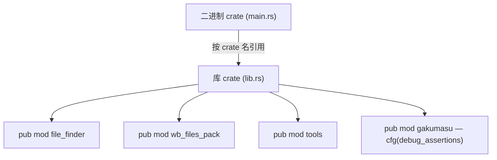
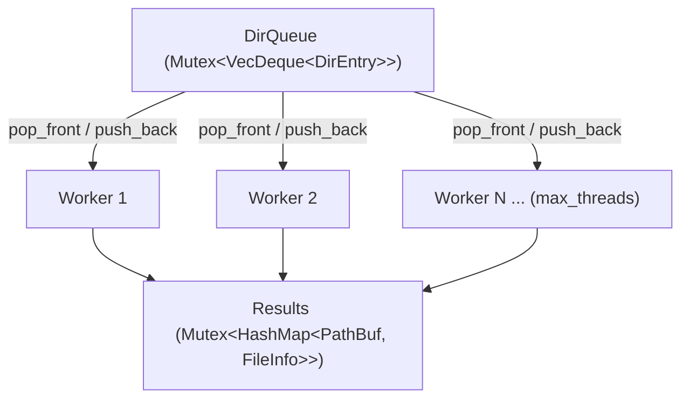
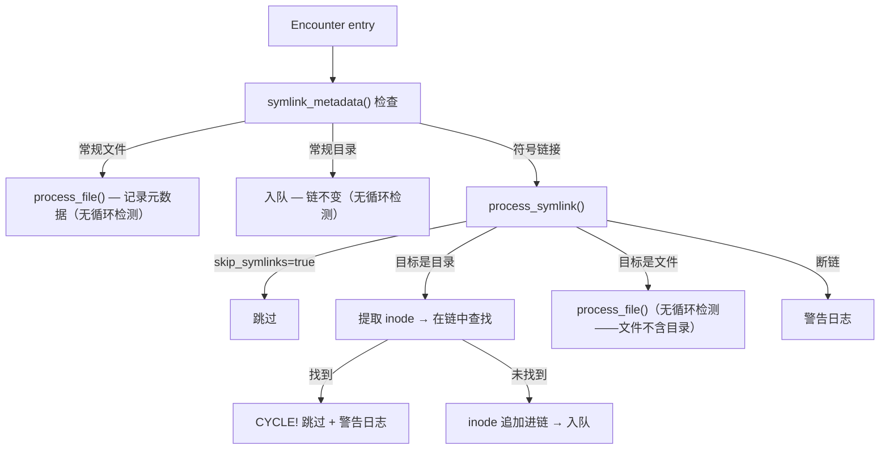
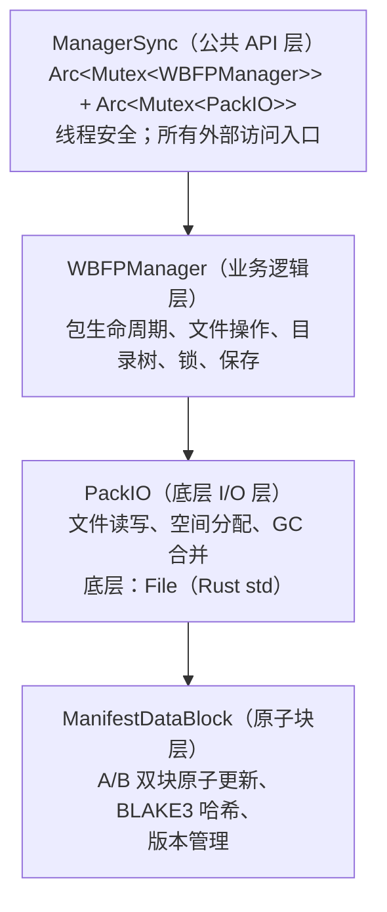
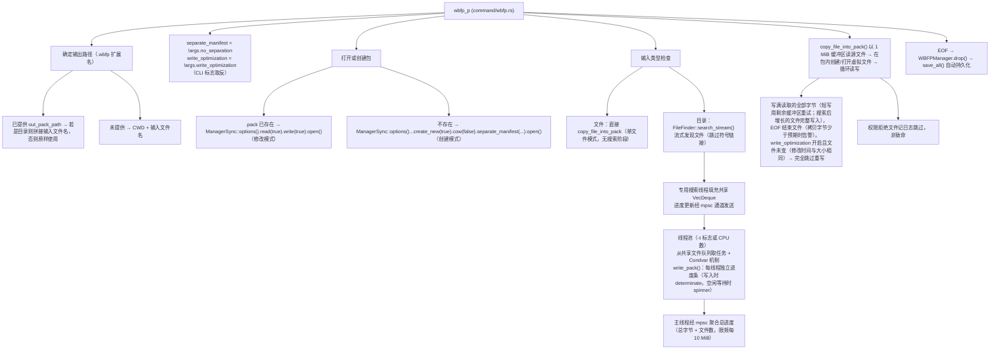
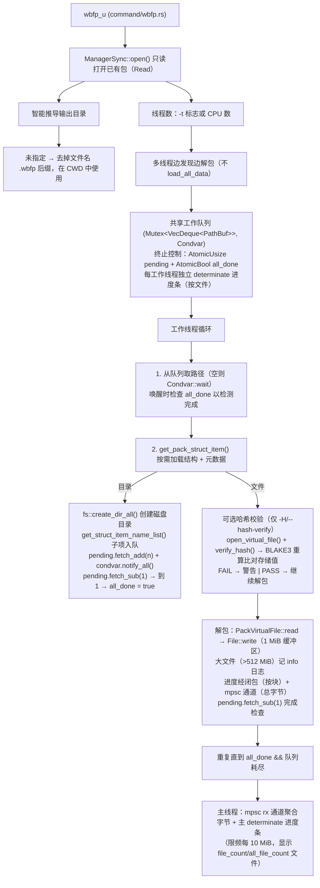
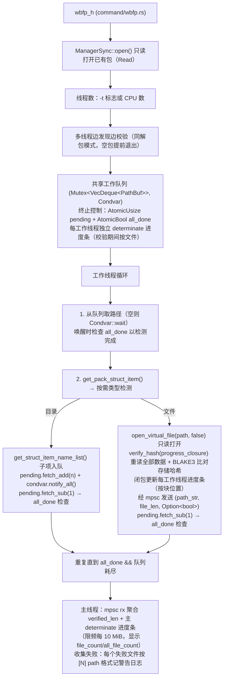
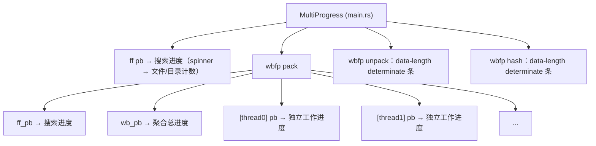
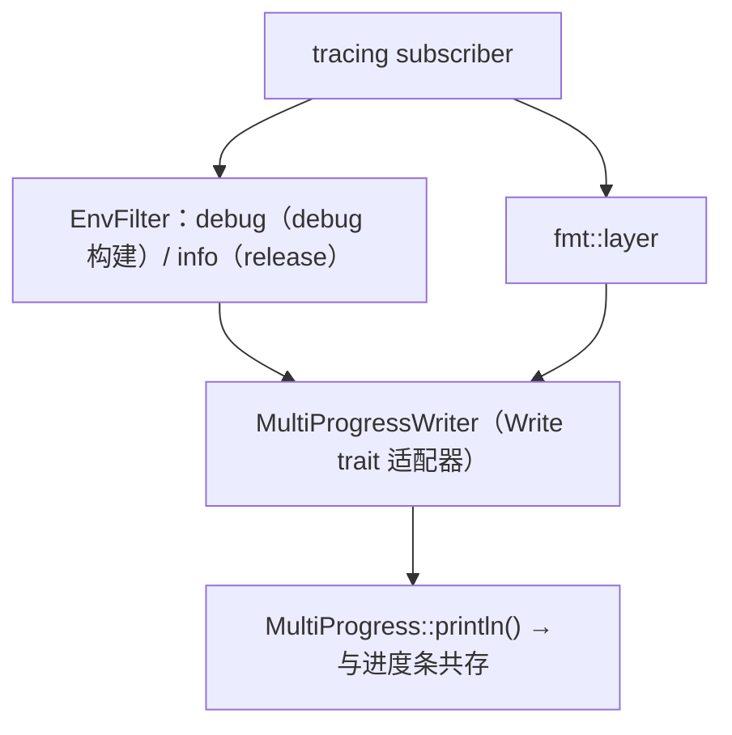

# 水球工具 WaterBall Tool：架构
> **语言**: [English](../ARCHITECTURE.md) | 简体中文

> 最后更新：2026-07-29

---

## 目录

1. [概述](#1-概述)
2. [技术栈](#2-技术栈)
3. [模块依赖图](#3-模块依赖图)
4. [二进制 crate 与库 crate](#4-二进制-crate-与库-crate)
5. [入口点与 CLI 路由](#5-入口点与-cli-路由)
6. [文件搜索器（`ff`）](#6-文件搜索器ff)
7. [水球包文件（`wbfp`）](#7-水球包文件wbfp)
8. [进度条系统](#8-进度条系统)
9. [日志系统](#9-日志系统)
10. [工具模块](#10-工具模块)
11. [开发中模块](#11-开发中模块)
12. [测试架构](#12-测试架构)
13. [设计决策与权衡](#13-设计决策与权衡)

---

## 1. 概述


水球工具（WaterBall Tool）是一个多用途 CLI 工具箱，使用 **Rust（edition 2024）** 编写。目前提供两个核心功能：

- **`ff`**：多线程并行文件搜索器，输出 JSON 文件清单，带符号链接循环检测
- **`wbfp`**：自定义二进制归档格式（水球包文件 WaterBall Files Pack）：打包、解包、BLAKE3 哈希校验

项目遵循标准 Rust **二进制 crate + 库 crate** 拆分：二进制 crate 处理 CLI 入口，库 crate 暴露可复用模块。


> 部分内容由 AI (deepseek-v4-pro) 生成，以 `//AI===` / `//AI_END===` 标记。

---

## 2. 技术栈


|  类别  |  Crate  |  用途  |
| --- | --- | --- |
|  CLI  |  `clap 4.6`（derive）  |  参数解析  |
|  序列化  |  `serde` / `serde_json`  |  数据结构、JSON 输出  |
|  哈希  |  `blake3 1.8`  |  文件数据完整性  |
|  进度条  |  `indicatif 0.18`  |  终端 spinner 与进度条  |
|  日志  |  `tracing` / `tracing-subscriber`  |  结构化日志（env-filter）  |
|  进程检测  |  `sysinfo 0.39`  |  锁文件的 PID 存活检查  |
|  随机  |  `rand 0.10`  |  随机测试数据（长时间测试：随机目录树搜索压力测试、大夹具）  |
|  测试工具  |  `pretty_assertions 1.4`  |  可 diff 的断言输出  |

---

## 3. 模块依赖图


```
main.rs (binary)
  ├── command.rs          ← CLI 路由
  │   ├── command/ff.rs   ← ff 子命令
  │   ├── command/wbfp.rs ← wbfp 子命令
  │   └── command/test.rs ← 集成测试
  └── 依赖：
      water_ball_tool (library crate)
        ├── file_finder.rs          ← 文件搜索核心
        │   └── file_finder/test.rs ← 符号链接测试
        ├── wb_files_pack.rs        ← WBFP 模块根
        │   ├── data.rs             ← 核心数据类型（1762 行，最大模块）
        │   ├── error.rs            ← 错误类型
        │   ├── manager.rs          ← WBFPManager
        │   │   ├── open.rs         ← 创建/打开包文件
        │   │   ├── save.rs         ← 渐进式保存 + 节流
        │   │   ├── file_ops.rs     ← 虚拟文件创建 + 目录创建
        │   │   ├── tree.rs         ← 目录树遍历 + 惰性加载
        │   │   ├── metadata.rs     ← 文件句柄创建 + 元数据更新
        │   │   ├── lock.rs         ← 进程级写锁
        │   │   ├── gc.rs           ← GC 编排
        │   │   ├── delete.rs       ← 虚拟文件/目录删除 + 擦除
        │   │   └── test.rs         ← 内部 API 测试
        │   ├── manager_sync.rs ← 公共 API 层（Arc<Mutex<>>）
        │   │   └── test.rs         ← 公共 API 测试
        │   ├── pack_io.rs          ← 底层文件 I/O + 空间分配 + GC 合并
        │   │   │
        │   │   ├── file.rs         ← PackVirtualFile（带访问模式强制的虚拟文件句柄）
        │   │   ├── file_handle.rs  ← PackFileHandle（493 行，核心文件逻辑）
        │   │   └── file_hash.rs    ← PackFileHash（BLAKE3 状态机）
        │   ├── net_server.rs       ← 网络服务器（开发中）
        │   └── test.rs             ← 模块级测试
        ├── tools.rs                ← 路径工具 + 字节格式化
        └── gakumasu/              ← 游戏模拟器（开发中）
            ├── data.rs
            └── simulator.rs
```

---

## 4. 二进制 crate 与库 crate


```
src/main.rs       → binary crate   "water_ball_tool"
src/lib.rs        → library crate  "water_ball_tool"
```

**关键规则**

- `main.rs` 声明 `mod command;`：`command.rs` 对二进制 crate **私有**
- `command.rs` 通过 crate 名限定路径引用库代码，如 `water_ball_tool::file_finder`、`water_ball_tool::wb_files_pack`，而非 `crate::file_finder`
- `lib.rs` 导出公共模块：`file_finder`、`wb_files_pack`、`tools`、`gakumasu`（由 `#[cfg(debug_assertions)]` 门控，仅 debug 构建编译）

**依赖流向**



---

## 5. 入口点与 CLI 路由


### `main.rs`：入口点（81 行）

```
1. Cli::parse()       — clap derive parses CLI args
2. MultiProgress::new() — global progress bar container
3. init_global_logging(&mp) — initializes tracing subscriber
4. command::cli(cli, &mp) — routes to subcommand
```

**关键设计**：`MultiProgressWriter` 通过 `MultiProgress.println()` 将 `tracing` 输出适配为 `io::Write`，防止日志与进度条之间的视觉冲突。日志级别：debug 模式为 `debug`，release 模式为 `info`，由 `#[cfg(debug_assertions)]` 门控。


### `command.rs`：CLI 路由（121 行）

```rust
Cli {
    command: Commands::Ff(FileFinderArgs) | Commands::Wbfp(WaterBallFilePackArgs)
}
```

进度条辅助函数

|  函数  |  用途  |
| --- | --- |
|  `create_pb(mp)`  |  创建 spinner（不确定进度）  |
|  `set_pb_style2(pb, data_len)`  |  切换到确定性进度条模式（`=>-` 字符）  |
|  `update_pb(cb, ...)`  |  限频更新：每 10×BUF_LEN 字节触发一次  |

常量

|  常量  |  值  |  用途  |
| --- | --- | --- |
|  `BUF_LEN`  |  1 MiB  |  读写缓冲区大小  |
|  `PROGRESS_STYLE_TEMPLATE`  |  —  |  搜索进度条模板  |
|  `PACK_PROGRESS_STYLE_TEMPLATE`  |  —  |  打包/解包进度条模板（带前缀、百分比、字节）  |

---

## 6. 文件搜索器（`ff`）

### 6.1 多线程工作队列模型


架构：**共享工作队列 + 条件变量**模式。



**工作线程生命周期**

1. 生成时：`running_count` 递增
2. 循环：从队列 `pop_front()`
3. 队列为空：`running_count` 递减，检查是否为零
   - `running_count == 0` → `condvar.notify_all()`，线程退出
   - 否则 → `condvar.wait()`，唤醒后重新检查
4. 唤醒：`running_count` 递增，处理弹出的任务

**进度限频**：每 50 个文件 / 10 个目录通过 `pb.send((delta_files, delta_dirs))` 触发一次。


### 6.2 符号链接循环检测


每个工作线程维护独立的 **inode 链**（`Vec<InodeKey>`），由 `DirEntry` 携带：


```rust
struct DirEntry {
    path: PathBuf,
    symlink_chain: Vec<InodeKey>,  // 此路径上经符号链接进入的目录的 inode 链
}
```

**检测流程**



**平台差异**

|  平台  |  InodeKey 类型  |  提取方法  |
| --- | --- | --- |
|  Unix  |  `u128`  |  `(dev << 64) \| ino`  |
|  Windows  |  `PathBuf`  |  `canonicalize()` 回退到原路径  |

> **理由**：普通目录在正常文件系统中无法形成循环；只有符号链接才能闭合环路。这使检测机制精确作用于需要之处，对普通文件和目录零开销。

### 6.3 核心数据结构


```rust
pub struct FilesList {
    path: String,                            // 根搜索路径
    data_length: u64,                        // 总数据大小
    file_count: u64,                         // 文件数（不含目录）
    dir_count: u64,                          // 目录数
    files_list: HashMap<String, FileInfo>,   // 根的直接子项
}

pub struct FileInfo {
    name: String,           // 名称（不含路径）
    length: u64,            // File=实际大小, Dir=子树累计大小
    modified_time: u128,    // 自 UNIX 纪元起的毫秒数
    file_kind: FileKind,
}

pub enum FileKind {
    File,                   /
    Dir(Dir),               /
}

pub struct Dir {
    files_list: HashMap<String, FileInfo>,  // 直接子项
    file_count: u64,                        // 后代文件累计数
    dir_count: u64,                         // 后代目录累计数
}
```

### 6.4 流式搜索 API


| 特性 | `search()` | `search_stream()` |
|---|---|---|
|  `FilesList` 树  |  `(JoinHandle, Receiver<(PathBuf, FileInfo)>)`  |
|  `HashMap`（内存中）  |  无（零开销）
|  阻塞式、一次性
|  `ff` 命令  |  `wbfp` 打包（生产者-消费者）  |
|  `Some(results)`  |  `None`（跳过 HashMap

### 6.5 树重建


并行扫描产生扁平的 `HashMap<PathBuf, FileInfo>`。`build_tree()` 重建嵌套的 `FilesList`：


1. 按父路径对所有条目分组 → `HashMap<PathBuf, Vec<PathBuf>>`
2. 迭代式基于栈的后序构建（Pre/Post 状态机，带显式 `Fr` 帧），避免深层嵌套层次栈溢出；父子链接使用 `rposition()` 向后搜索以正确匹配路径
3. 目录 `length` = 所有后代文件大小之和
4. 目录 `file_count`/`dir_count` = 所有子目录的累计值

---

## 7. 水球包文件（`wbfp`）


**文件**：`src/wb_files_pack/*.rs`（共约 6,000+ 行）

### 7.1 总体架构


WBFP 采用 **三层架构**：



### 7.2 二进制格式


完整规范（中文）见 `docs/zh_CN/wb_files_pack/manifest-data.md`。摘要：


```
.pack 文件布局
┌────────────────────────────────────────────────────────┐
│  FILE_HEADER_BLOCK_LEN (128 + attribute block)         │
│  ├─ File header: magic "WBFilesPack", ver [0,2]        │
│  │   ├─ type_name (11B)                                │
│  │   ├─ version (2B)                                   │
│  │   ├─ bool_data (1B) — cow bit[0], s_manifest bit[1] │
│  │   ├─ pack_len (8B)                                  │
│  │   └─ padding to 128B                                │
│  └─ Embedded Attribute manifest data block             │
├────────────────────────────────────────────────────────┤
│  Data Region                                           │
│  ├─ File data blocks (DATA_DATA_BLOCK_LEN-aligned)     │
│  └─ (optional) manifest data (when !separate_manifest) │
├────────────────────────────────────────────────────────┤
│  Manifest Index                                        │
│  ├─ DataPosList (data free region list)                │
│  ├─ DataPosList (manifest free list, separated only)   │
│  ├─ PackStruct (root directory)                        │
│  │   └─ PackStructItem ... (recursive)                 │
│  └─ PackFileMetadata ... (per file/dir)                │
└────────────────────────────────────────────────────────┘
```

**关键常量**

|  常量  |  值  |  用途  |
| --- | --- | --- |
|  `DATA_BLOCK_LEN`  |  128 B  |  清单数据对齐单位  |
|  `DATA_DATA_BLOCK_LEN`  |  4 MiB  |  文件数据分配单位  |
|  `MANIFEST_VERSION`  |  10  |  当前清单格式版本  |
|  `MANIFEST_VERSION_COMPATIBLE`  |  10  |  最低兼容版本  |

### 7.3 核心数据结构


```rust
/// 顶层清单
pub struct WBFilesPackManifest {
    attribute: Attribute,         // 全局属性（常驻内存）
    root_struct: PackStruct,      // 根目录结构
    file: Option<PackIO>,         // 清单文件 I/O（分离模式）
}

/// 全局属性 — 包文件元数据
pub struct Attribute {
    version: u16,                              // 格式版本
    version_compatible: u16,                   // 兼容版本
    cow: bool,                                 // 写时复制
    empty_data_pos_list_pos: u64,              // 数据空闲列表位置
    manifest_empty_data_pos_list_pos: u64,     // 清单空闲列表位置
    manifest_file_len: u64,                    // 清单文件长度
    root_struct_pos: u64,                      // 根结构位置
    file_count: u64,                           // 总文件数
    dir_count: u64,                            // 总目录数
    data_len: u64,                             // 总数据大小
    data_block: ManifestDataBlock,
    dirty: bool,                               // 脏标记
}

/// 目录结构节点
pub struct PackStruct {
    items: HashMap<String, PackStructItem>,    // 子项
    data_block: ManifestDataBlock,
    dirty: bool,
}

/// 目录条目
pub struct PackStructItem {
    name: String,
    metadata_file_pos: u64,                    // 元数据位置
    item_type: PackStructItemType,
    metadata: PackFileMetadataRun,             // 状态机
}

pub enum PackStructItemType {
    File { handle: Option<Weak<Mutex<PackFileHandle>>> },
    Dir { struct_file_pos: u64, pack_struct: Option<PackStruct> },
}

/// 元数据状态机 — 控制访问生命周期
pub enum PackFileMetadataRun {
    None,                                       // 无元数据
    NoLoad,                                     // 尚未加载
    Loaded(Box<PackFileMetadata>),              // 就绪可用
    Locked,                                     // 写入进行中
}

pub enum PackFileMetadataType {
    File {
        hash_type: u8,                          // 1 = BLAKE3
        hash_value: Vec<u8>,                    // 哈希值
        data_pos_list: DataPosList,             // 已分配块位置
    },
    Dir {
        file_count: u64,                        // 子文件累计数
        dir_count: u64,                         // 子目录累计数
    },
}

/// 双用途位置列表
///   PackIO.empty_data_list  → 跟踪 FREE（可复用）区域
///   PackFileMetadata.data_pos_list → 跟踪 ALLOCATED（已分配）块
pub struct DataPosList {
    data_block: Option<ManifestDataBlock>,
    list: Vec<(u64, u64)>,                      // (位置, 长度) 对
}
```

### 7.4 清单数据块：A/B 双块机制


**文件**：`src/wb_files_pack/data.rs`（1762 行，最大的单一模块）

所有索引数据（Attribute、PackStruct、PackFileMetadata、DataPosList）都存储在 `ManifestDataBlock` 实例中。


**A/B 双块结构**

```
┌──────── A Block ────────┬──────── B Block ────────     ┐
│ len(8) │ ver(4) │ hash(8) │ data(...) │ ver(4) │ ...   │
└─────────────────────────┴─────────────────────────     ┘
──────────────────────────────────────────────────────────
        Entire block = aligned to multiples of DATA_BLOCK_LEN (128B)
```

**原子更新流程**

1. 读取两个半块，提取各自的版本号
2. 写入版本**较低**的半块（`ver + 1`）
3. 另一半块保持不变
4. 部分写入后崩溃 → 至少保留一个完整版本

**读取流程**

1. 检查 A 块头尾版本匹配（快速完整性检查）
2. 同样检查 B 块
3. 选择通过校验且版本较高的半块

**块大小计算**

```
block_len = ceil((24 + data_len) × 2 / DATA_BLOCK_LEN) × DATA_BLOCK_LEN
```

**版本回绕**

```rust
fn next_ver(ver: u32) -> u32 {
    if ver == u32::MAX { 1 } else { ver + 1 }
}

// 使用包装减法正确处理 u32 回绕
fn ver_is_older(a: u32, b: u32) -> bool {
    a != b && b.wrapping_sub(a) < a.wrapping_sub(b)
}
```

### 7.5 空间分配与垃圾回收


**核心文件**：`src/wb_files_pack/pack_io.rs`（402 行），PackIO 层

**空间分配 `get_file_pos(length)`**

```
1. Align length to DATA_BLOCK_LEN (128B) boundary
2. Try free list first (empty_data_list):
   └─ Exact match → remove from list, return
   └─ Larger than needed → split: allocate front, keep remainder
3. No suitable free block → extend file: return (file.len, length)
```

**数据分配**
  Pass 1
  `get_pos_contiguous`
  `MAX_DATA_SEGMENTS`(16)
- 已知大小（`alloc_size(Some(len))`，例如搜索已得知长度）通过 `get_file_pos` 以 128B 对齐精确分配，与包全局对齐规则一致，无浪费。未知大小（`alloc_size(None)`，默认）通过 4MiB 对齐的 `get_data_file_pos_multi`（初始 `create_file_raw`）分配，先复用空闲碎片：第 1 遍单块首次适配（`get_pos_gc`）→ 第 2 遍物理相邻碎片的连续链（`get_pos_contiguous`）→ 第 3 遍最大优先累积（`get_pos_biggest`）；`empty_data_list` 顺序从不改变；碎片不足时回退为扩展文件。段数计入虚拟文件的数据段列表（`data_pos_list` 现有 + 新增），上限 `MAX_DATA_SEGMENTS`（16）；超限分配以错误拒绝（无部分写入）。碎片由 `file_gc`（在 `save_all` 期间）批量排序并入 `empty_data_list`，之后才参与复用。打开已有文件时忽略 `alloc_size`（绝不缩小已有分配）。清单数据始终使用 128B 对齐的 `get_file_pos`。

**垃圾回收**

```
Stage 1 — Staging (file_gc_add):
   ├─ PackFileHandle drops → manager → file_gc_add buffers into gc_data_pos_list

Stage 2 — Merging (file_gc):
   ├─ Append staging items to empty_data_list, then batch sort_unstable_by_key(pos)
   │  O((K+M) log(K+M))
   │  batch sort replaces the previous insertion sort
   ├─ Single-pass merge adjacent: pos1 + len1 == pos2 → merge into one block
   └─ Write updated empty data list
```

**GC 触发点**

- `WBFPManager.save_all()` → `file_gc()` + `manifest_file_gc()`
- 文件缩小或覆写 → `PackFileHandle::commit_data()`（drop 时）/ drop

### 7.6 渐进式保存


**文件**：`src/wb_files_pack/manager/save.rs`（200 行）

**节流条件 `throttled_save()`**

```rust
// 触发 save_all() 的条件：
if all_write_len - last_all_write_len > 64 * 1024 * 1024  // 已写入 64MiB
   || all_cr_file_count - last_all_cr_file_count > 10_000  // 或新增 10K 文件
```

**`save_all()` 流程**

1. `file_gc()`：数据区垃圾回收
2. `manifest_file_gc()`：清单文件垃圾回收
3. `save_root_pack_struct()`：持久化根结构（dirty 检查）
   - 若 dirty，同时调用 `save_manifest_attribute()`
4. `save_pack_length()`：更新文件头中的 pack_len

**Dirty 标志链**

`save_all()`（可见性：`pub(crate)`）也会在 `WBFPManager.drop()` 中被调用，进程退出时数据始终持久化（除非发生 panic）。


### 7.7 进程级写锁


**文件**：`src/wb_files_pack/manager/lock.rs`（134 行）

```
Flow
1. Create .lock file, write current PID as little-endian u32
2. sync_all() — ensure persistence
3. File::lock() — acquire OS-level exclusive lock
4. On process exit (Drop): file.unlock() + delete .lock file
```

**锁检测 `write_lock_info()`**

- 从 `.lock` 文件读取 PID
- `sysinfo::System::new_all()` → 检查 PID 是否存活
- PID 不存活 → panic，提示手动移除锁文件
- `.lock` 是目录 / 符号链接 → 报错（异常状态）

### 7.8 公共 API 层：ManagerSync


**文件**：`src/wb_files_pack/manager_sync.rs`（438 行）

`ManagerSync` 是包住 `WBFPManager` + `PackIO` 的线程安全包装：


```rust
#[derive(Clone)]
pub struct ManagerSync {
    access_mode: PackAccessMode,  // 在打开时强制只读/只写/读写
    manager: Arc<Mutex<WBFPManager>>,
    pack_io: Arc<Mutex<PackIO>>,
}
```

**公共 API 面**

|  类别  |  方法  |  用途  |
| --- | --- | --- |
|  **打开/创建**  |  `open(path)`  |  只读打开已有包  |
|   |  `create_new(path)`  |  创建新包（使用 PackOpenOptions 默认值），已存在则失败  |
|   |  `options() -> PackOpenOptions`  |  完整构造器：`read()`/`write()`/`create()`/`create_new()`/`cow()`/`separate_manifest()`  |
|  **虚拟文件**  |  `open_virtual_file(path, end_pos)`  |  只读打开已有虚拟文件  |
|   |  `create_virtual_file(path)`  |  只写创建新虚拟文件  |
|   |  `virtual_file_options() -> VirtualFileOpenOptions`  |  构造器：`read()`/`write()`/`create_new()`/`end_pos()`/`alloc_size()`  |
|  **读取**  |  `get_manifest_attribute` / `get_root_struct_items` / `get_dir` / `load_all_data`  |   |
|  **写入**  |  `create_dir_all` / `delete_file` / `delete_dir_all`  |   |
|  **删除**  |  `delete_file` / `delete_dir_all`  |  移除元数据 + 结构，数据块提交 GC（不覆写）  |
|  **擦除**  |  `erase_file(strategy)` / `erase_dir_all(strategy)`  |  覆写数据 + 清单块 → GC → 移除  |
|  **校验**  |  `verify_all_file_hash`  |  递归哈希校验所有文件  |

**覆写策略**

|  策略  |  遍数  |  说明  |
| --- | --- | --- |
|  `Zero`  |  1  |  单遍 0x00  |
|  `Random`  |  1  |  单遍随机字节  |
|  `Dod5220`  |  3  |  DoD 5220.22-M：0x00 → 0xFF → 随机（每遍写入磁盘）  |

> `PackStruct` 上的 `child_locked_count` 跟踪有多少后代文件持有活动写句柄。仅当 `child_locked_count == 0` 时目录才能被删除/擦除。

**设计说明**

- `Arc<Mutex<>>` 保证线程安全，多个 `PackVirtualFile` 实例可并发操作
- 每个方法都获取 manager 锁 → 串行访问
- `ManagerSync` 实现 `Clone`，多个持有者共享同一个包引用 / Clone

### 7.9 虚拟文件 I/O：PackVirtualFile + PackFileHandle


**PackVirtualFile**（`pack_io/file.rs`，210+ 行），由 `PackFileWR` 更名：

- 实现 `Read + Write + Seek` trait，带**访问模式强制**
- 持有 `Arc<Mutex<PackFileHandle>>`
- 跟踪 `pos`（当前读写位置）+ `AccessMode`（Read/Write/ReadWrite）
- 所有操作委托给 `PackFileHandle`
- 通过 `VirtualFileOpenOptions` 构造器模式打开（兼容 std::fs::File）
- `get_len()` 返回 `u64`（非 `Result<u64>`）；`get_modified()` 返回 `u128`（非 `Result<u128>`），内部锁获取不再产生可恢复错误
- Mutex 毒化恢复全程使用 `std::sync::PoisonError::into_inner`

**PackFileHandle**（`pack_io/file_handle.rs`，493 行，最复杂的单一文件

```
Responsibilities
    1. Virtual file position management (sparse file support)
    2. Allocation: DataPosList-managed (position, length) list
    3. set_len: grow → auto-allocate new blocks; shrink → release excess → GC
    4. write: map virtual position → real file offset → pack_io.write
    5. read:  map virtual position → real file offset → pack_io.read
    6. commit_data (Drop): compute hash → write back metadata → release pre-allocated space

```

**位置映射缓存**：`temp_pos_index` + `temp_pos_this_len` 避免每次读写遍历整个 DataPosList。


**Drop 行为**：`PackFileHandle.drop()` 自动调用 `commit_data()`：

1. 计算并持久化文件哈希
2. 释放预分配但未使用的空间（通过 `set_len(metadata_len)`）
3. 将元数据归还给 `WBFPManager.file_metadata_update()`

### 7.10 哈希系统


**文件**：`src/wb_files_pack/pack_io/file_hash.rs`（81 行）

```rust
enum PackFileHash {
    None,
    Blake3 { hasher: Box<Hasher>, hash_value: Vec<u8> },
}
```

- 类型 0：`None`（目录类型）
- 类型 1：`Blake3`（文件类型）
- `update()`：增量哈希更新
- `get_hash_value()`：终结哈希
- `eq()`：与存储的哈希值比较

**哈希校验触发点**

- 打包/写入：`PackFileHandle.commit_data()` → `read_hash_v()` 在关闭时重算
- 解包/读取：`PackVirtualFile::verify_hash()` 可选的读取前校验
- CLI：`wbfp h` 命令遍历所有文件

### 7.11 错误类型


**文件**：`src/wb_files_pack/error.rs`（67 行）

```rust
pub enum PackFileError {
    Io(std::io::Error),
    Lock(String),
    Integrity(String),
    Format(String),
    NotFound(String),
    NotADirectory(String),
    PermissionDenied(String),
    Version(String),
    State(String),
    Other(String),
}
```

- `From<std::io::Error>` → 支持 `?` 操作符
- `From<PackFileError> for std::io::Error` → 支持 Read/Write/Seek trait 实现
- 双语 `Display` 消息（中文 + 英文），使用内联格式变量 `{e}`、`{msg}`，无冗余的 `format!` 调用

### 7.12 打包流程




### 7.13 解包流程




### 7.14 哈希校验流程




---

## 8. 进度条系统


**核心设计**：`indicatif::MultiProgress` 管理所有子进度条，支持并发多线程更新。


**层级结构**



**进度条模式**

|  模式  |  模板  |  使用场景  |
| --- | --- | --- |
|  Spinner  |  `{spinner} {msg} ({pos})`  |  未知总量的搜索  |
|  Determinate  |  `PROGRESS_STYLE_TEMPLATE`（`=>-` 字符）  |  已知总量的打包  |
|  Determinate+  |  `PACK_PROGRESS_STYLE_TEMPLATE`（百分比、字节）  |  解包、哈希校验  |

**限频**：`update_pb()` 每 10×BUF_LEN（10 MiB）触发一次，避免过多 UI 刷新。


---

## 9. 日志系统


**文件**：`src/main.rs` 中的 `init_global_logging`



**关键设计**：`MultiProgressWriter` 将 `tracing` 输出经 `MultiProgress.println()` 重定向，消除终端中日志与进度条的视觉重叠。


---

## 10. 工具模块


**文件**：`src/tools.rs`（108 行）

|  函数/类型  |  用途  |
| --- | --- |
|  `PathTool::path_to_string_vec`  |  将路径拆分为字符串片段，不含根分隔符  |
|  `PathTool::path_remove_head`  |  去除路径 head 前缀，得到相对路径  |
|  `bytes_len_to_string(len)`  |  将字节数格式化为 B / KiB / MiB / GiB（2 位小数）  |
|  `TestTool::remove_test_pack_files`  |  测试后清理 `.pack`、`.wbm`、`.lock` 文件  |

---

## 11. 开发中模块


### gakumasu（游戏模拟器

**文件**：`src/gakumasu/data.rs`（116 行）、`src/gakumasu/simulator.rs`（10 行）

- 由 `#[cfg(debug_assertions)]` 门控，仅 debug 构建编译
- 尚未接入 CLI
- 定义卡片系统类型（技能卡、场地效果卡）、属性系统、效果条件
- 中文命名约定（学园偶像大师日文术语）
- `simulator.rs` 含空的 `GameSimulator` 结构体和 `GameRunning` 运行时状态

### net_server（网络服务器

**文件**：`src/wb_files_pack/net_server.rs`（27 行）

- 由 `#[cfg(debug_assertions)]` 门控，仅 debug 构建编译
- `WBFPServer` 骨架：管理多个包的 `HashMap<String, ManagerSync>`
- `WBFPServerClient` 骨架：单个客户端连接
- 尚无网络监听逻辑

---

## 12. 测试架构


|  文件  |  类型  |  覆盖范围  |
| --- | --- | --- |
|  `command/test.rs`  |  集成  |  ff + wbfp 命令、跨平台符号链接循环检测、合成夹具长时间测试（经 `rand` 生成 1000 个随机文件）  |
|  `file_finder/test.rs`  |  单元  |  符号链接发现、祖先循环、多层、断链、混合场景、链传播、search_stream  |
|  `wb_files_pack/test.rs`  |  模块  |  包文件创建、读写、校验  |
|  `wb_files_pack/manager/test.rs`  |  内部 API  |  Manager 内部逻辑  |
|  `wb_files_pack/manager_sync/test.rs`  |  公共 API  |  删除 + 擦除（11 个测试）、文件创建/读写/重开、cow、哈希校验、线程访问  |

**测试规范**

- 慢速测试标记为 `#[ignore = "longtime"]`，通过 `cargo test` 跳过（
- 测试临时目录：`./temp/test/`（gitignore）
- 使用 `indicatif::MultiProgress` 的测试必须先调用 `crate::init_global_logging(&mp)`
- `TestTool::remove_test_pack_files(path)` 用于包文件测试清理
- 跨平台测试使用 `#[cfg(unix)]` / `#[cfg(windows)]` 做编译门控

---

## 13. 设计决策与权衡


### 文件搜索器（File Finder）

|  决策  |  理由  |
| --- | --- |
|  每线程 inode 链（而非全局映射）  |  更简单、无锁；循环罕见且通常只在单一路径上  |
|  扁平 HashMap + 扫描后重建树  |  比扫描期间维护嵌套树更高效  |
|  对普通文件/目录不做循环检查  |  文件系统无法用普通目录形成循环；只有符号链接需要检测  |
|  Windows 使用 PathBuf 作为 InodeKey  |  Windows 上无法可靠获取 (dev, ino)；以 canonicalize 作为最佳近似  |

### WBFP

|  决策  |  理由  |
| --- | --- |
|  A/B 双块而非 WAL  |  实现更简单；无需独立日志文件或重放逻辑  |
|  BLAKE3 截断为 8 字节  |  存储受限；8 字节碰撞概率可忽略  |
|  PackIO 同时实现 Read+Write  |  集中化 I/O；易于切换分离/嵌入模式  |
|  默认分离清单  |  核心包文件无需修改，降低损坏风险  |
|  目录结构懒加载  |  打开时无需解析整个包；按需加载  |
|  渐进式（节流）保存  |  防止长时间打包操作期间断电导致数据丢失  |
|  PID 锁文件 + sysinfo  |  比纯文件锁更可靠；检测陈旧锁  |
|  `Arc<Mutex<>>` 而非 Actor 模型  |  实现更简单；直接状态共享，无消息传递  |
|  PackFileHandle 在 Drop 时提交  |  即使调用方忘记关闭也能保证持久化  |
|  每个 PackStruct 的 `child_locked_count`  |  目录安全：文件句柄创建时递增，解锁时递减；> 0 时阻止删除/擦除  |
|  删除与擦除作为独立 API  |  删除快速（仅元数据 I/O，数据 GC 不覆写）；擦除在移除前覆写磁盘上每个字节  |
|  DoD 5220 每遍写入磁盘  |  三遍（0x00、0xFF、随机）都执行独立磁盘写入，而非仅在内存缓冲区中反复读写  |

### 总体（Overall）

|  决策  |  理由  |
| --- | --- |
|  二进制 + 库 crate 拆分  |  CLI 专用代码留在二进制 crate；可复用逻辑分离  |
|  command.rs 使用 crate 名限定路径  |  `command.rs` 在二进制 crate 中，而非库中  |
|  `PackFileError` 双向实现 `From`  |  支持 `?` 操作符 + Read/Write/Seek trait 实现  |
|  全程双语注释  |  中文开发者、英文代码；注释两种语言皆有  |
