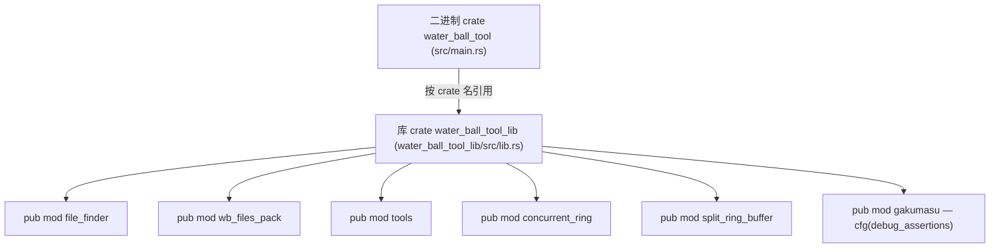
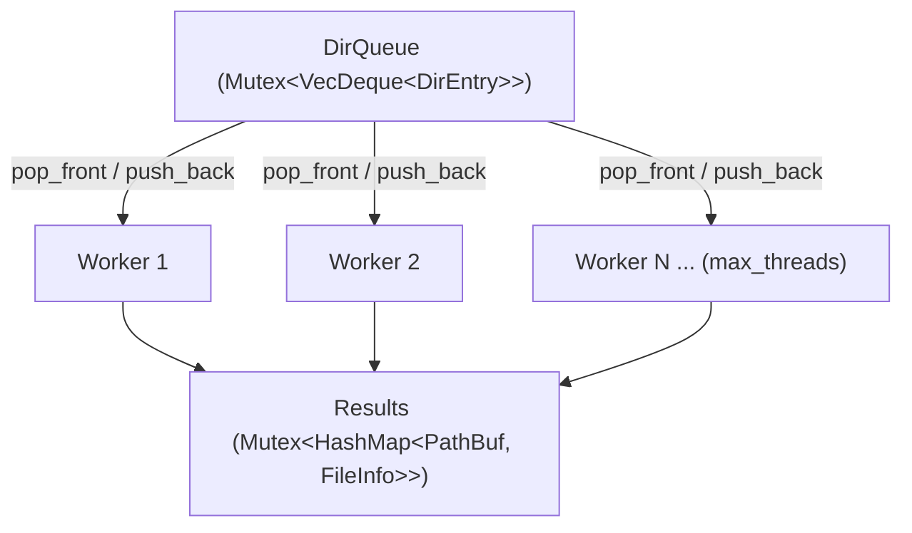
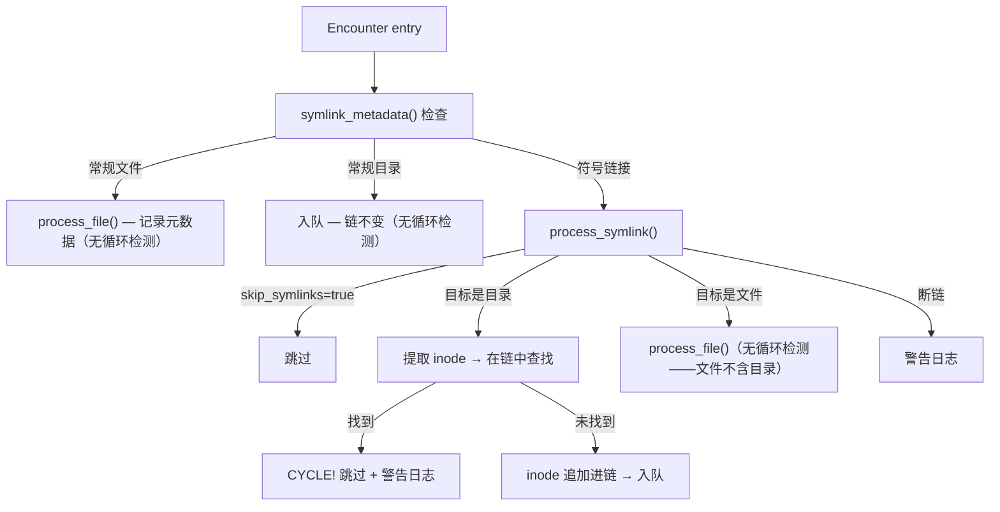
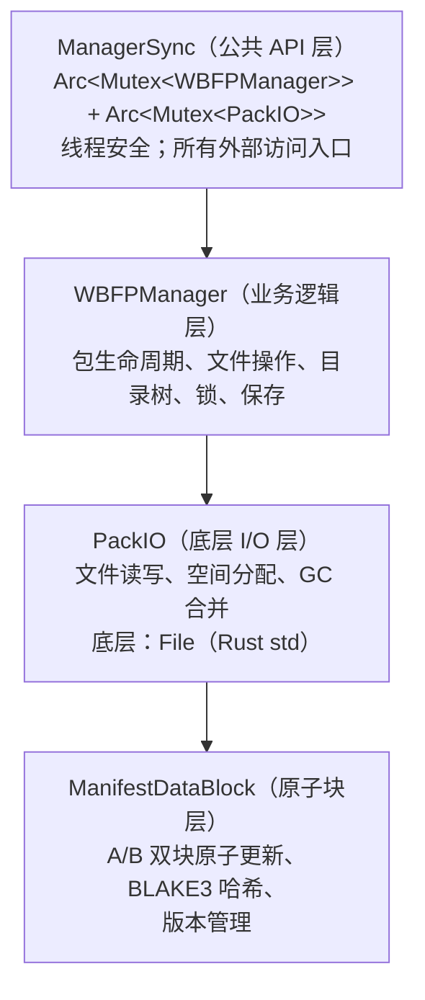
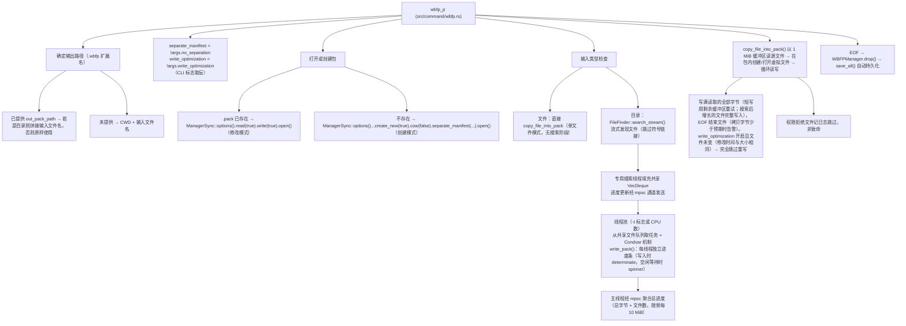
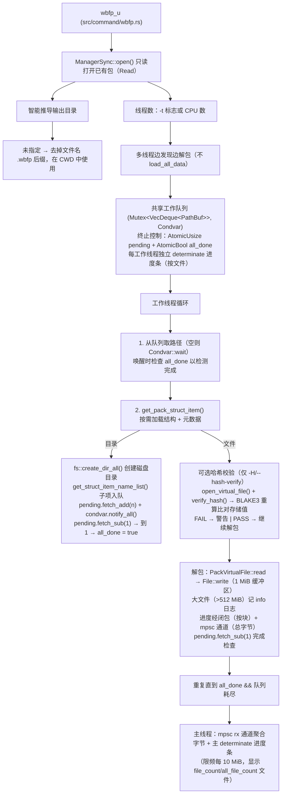
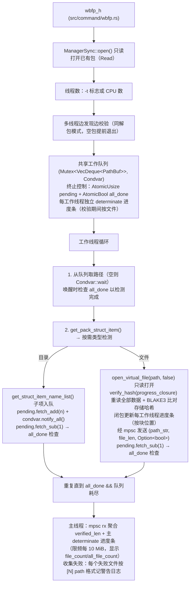
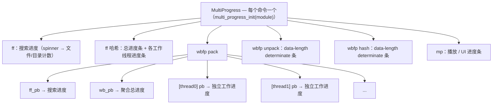
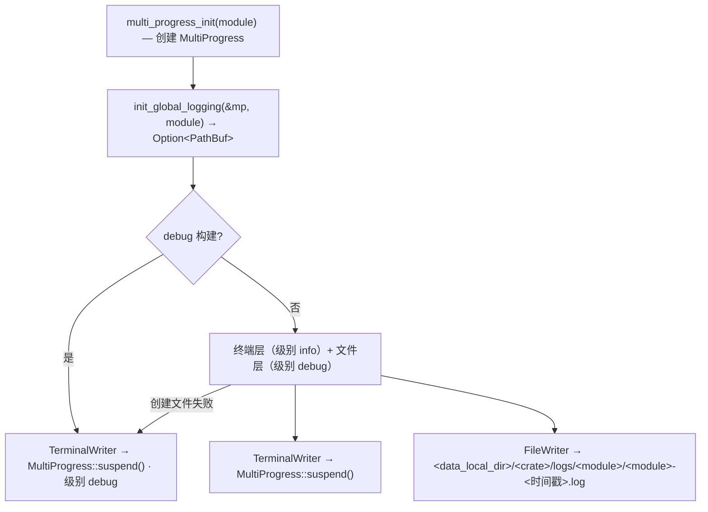

# 水球工具 WaterBall Tool：架构

> **语言**: [English](../ARCHITECTURE.md) | 简体中文

> 最后更新：2026-10-31

---

## 目录

1. [概述](#1-概述)
2. [技术栈](#2-技术栈)
3. [模块依赖图](#3-模块依赖图)
4. [二进制 crate 与库 crate](#4-二进制-crate-与库-crate)
5. [入口点与 CLI 路由](#5-入口点与-cli-路由)
6. [文件搜索器（`ff`）](#6-文件搜索器ff)
7. [音乐播放器（`mp`）](#7-音乐播放器mp)
8. [水球包文件（`wbfp`）](#8-水球包文件wbfp)
9. [进度条系统](#9-进度条系统)
10. [日志系统](#10-日志系统)
11. [工具模块](#11-工具模块)
12. [开发中模块](#12-开发中模块)
13. [测试架构](#13-测试架构)
14. [设计决策与权衡](#14-设计决策与权衡)

---

## 1. 概述

水球工具（WaterBall Tool）是一个多用途 CLI 工具箱，使用 **Rust（edition 2024）** 编写。目前提供三个核心功能：

- **`ff`**：多线程并行文件搜索器，输出 JSON 文件清单，带符号链接循环检测与可选的逐文件哈希
- **`wbfp`**：自定义二进制归档格式（水球包文件 WaterBall Files Pack）：打包、解包、BLAKE3 哈希校验
- **`mp`**：终端音乐播放器：音频播放、播放列表模式、stdin 交互控制，以及实时安全的音频线程架构（`tui/` 界面仍在开发中）

仓库是 cargo **workspace**：`water_ball_tool` 二进制 crate（CLI 入口，`src/`）依赖 `water_ball_tool_lib` 库 crate
（`water_ball_tool_lib/src/`），后者暴露可复用模块。


> 部分内容由 AI (deepseek-v4-pro) 生成，以 `//AI===` / `//AI_END===` 标记。

---

## 2. 技术栈

| 类别        | Crate                                                     | 用途                                                       |
|-------------|-----------------------------------------------------------|------------------------------------------------------------|
| CLI         | `clap 4.6`（derive）                                      | 参数解析                                                   |
| 序列化      | `serde` / `serde_json`                                    | 数据结构、JSON 输出                                        |
| 哈希        | `blake3 1.8`                                              | 包文件数据完整性                                           |
| 哈希（CLI） | `sha1` / `sha2` / `blake2b_simd` / `md-5` / `crc32fast`   | `ff` 逐文件哈希算法                                        |
| 进度条      | `indicatif 0.18`                                          | 终端 spinner 与进度条                                      |
| 日志        | `tracing` / `tracing-subscriber`                          | 结构化日志（env-filter）+ 可选日志文件                     |
| 进程检测    | `sysinfo 0.39`                                            | 锁文件的 PID 存活检查                                      |
| 随机        | `rand 0.10`                                               | 随机测试数据（长时间测试：随机目录树搜索压力测试、大夹具） |
| 测试工具    | `pretty_assertions 1.4`                                   | 可 diff 的断言输出                                         |
| 音频        | `cpal 0.18` / `symphonia 0.6` / `rubato 5` / `lofty 0.25` | 音频输出、解码、重采样、标签读取                           |
| 终端 UI     | `ratatui 0.30`                                            | 开发中的 `mp` TUI                                          |
| 线程通道    | `crossbeam-channel 0.5`                                   | 实时安全的有界通道（音频回调）                             |

---

## 3. 模块依赖图

```
water_ball_tool（二进制 crate，根包）
  ├── src/main.rs          ← CLI 入口；声明 `mod command;`
  ├── src/command.rs       ← CLI 路由 + 进度条辅助函数
  │   ├── command/ff.rs    ← ff 子命令（搜索 + 可选哈希）
  │   ├── command/wbfp.rs  ← wbfp 子命令
  │   ├── command/music_play.rs
  │   │   └── command/music_play/
  │   │       ├── player.rs          ← cpal 输出流 + transport + try_stop
  │   │       ├── decoder_runtime.rs ← symphonia 解码线程
  │   │       ├── effect.rs          ← 效果器 trait / 音频类型
  │   │       │   └── effect/        ← resampler / cross_bridge / fade / runtime
  │   │       ├── play_list.rs       ← 曲目列表 + 循环/洗牌模式
  │   │       ├── runtime.rs         ← 播放编排 + UI 线程
  │   │       ├── event_dispatch.rs  ← 实时事件/日志分发线程
  │   │       ├── tools.rs           ← 时间统计 / 耗时累加器
  │   │       └── tui/               ← 终端 UI（开发中）
  │   └── command/test.rs  ← 集成测试
  └── 依赖：
      water_ball_tool_lib（库 crate，workspace 成员）
        ├── src/file_finder.rs          ← 文件搜索核心
        │   └── file_finder/test.rs     ← 符号链接测试
        ├── src/wb_files_pack.rs        ← WBFP 模块根
        │   ├── data.rs                 ← 核心数据类型（1762 行，最大模块）
        │   ├── error.rs                ← 错误类型
        │   ├── manager.rs              ← WBFPManager
        │   │   ├── open.rs             ← 创建/打开包文件
        │   │   ├── save.rs             ← 渐进式保存 + 节流
        │   │   ├── file_ops.rs         ← 虚拟文件创建 + 目录创建
        │   │   ├── tree.rs             ← 目录树遍历 + 惰性加载
        │   │   ├── metadata.rs         ← 文件句柄创建 + 元数据更新
        │   │   ├── lock.rs             ← 进程级写锁
        │   │   ├── gc.rs               ← GC 编排
        │   │   ├── delete.rs           ← 虚拟文件/目录删除 + 擦除
        │   │   └── test.rs             ← 内部 API 测试
        │   ├── manager_sync.rs         ← 公共 API 层（Arc<Mutex<>>）
        │   │   └── test.rs             ← 公共 API 测试
        │   ├── pack_io.rs              ← 底层文件 I/O + 空间分配 + GC 合并
        │   │   ├── file.rs             ← PackVirtualFile（带访问模式强制）
        │   │   ├── file_handle.rs      ← PackFileHandle（493 行，核心文件逻辑）
        │   │   └── file_hash.rs        ← PackFileHash（BLAKE3 状态机）
        │   ├── net_server.rs           ← 网络服务器（开发中，仅 debug 构建）
        │   └── test.rs                 ← 模块级测试
        ├── src/tools.rs                ← 路径工具 + 字节格式化 + 测试辅助
        ├── src/concurrent_ring.rs      ← 可并发初始化的环形缓冲区
        ├── src/split_ring_buffer.rs    ← 读写分离有锁/无锁环形缓冲区
        │   └── inner / reader / writer / mode / error / test
        └── src/gakumasu/               ← 游戏模拟器（开发中，仅 debug 构建）
            ├── data.rs
            └── simulator.rs
```

---

## 4. 二进制 crate 与库 crate

```
Cargo.toml                       → [workspace] resolver = "3"，members = ["water_ball_tool_lib"]
                                   另含 [package] "water_ball_tool"（二进制，src/）
water_ball_tool_lib/Cargo.toml   → [package] "water_ball_tool_lib"（库）
```

**关键规则**

- 根包是二进制 crate `water_ball_tool`；`main.rs` 声明 `mod command;`——`command.rs` 对二进制 crate **私有**。
- 库 crate `water_ball_tool_lib` 导出：`file_finder`、`wb_files_pack`、`tools`、`concurrent_ring`、`split_ring_buffer`，
  以及 `gakumasu`（由 `#[cfg(debug_assertions)]` 门控，仅 debug 构建编译）。
- 二进制代码通过 crate 名限定路径引用库——`water_ball_tool_lib::file_finder`、`water_ball_tool_lib::wb_files_pack`、
  `water_ball_tool_lib::tools` 等——而非 `crate::file_finder`。
- 两个包通过 `[workspace.package]` / `[workspace.dependencies]` 共享元数据与依赖。

**依赖流向**


```mermaid
flowchart TD
    bin["二进制 crate water_ball_tool (src/main.rs)"]
    lib["库 crate water_ball_tool_lib (water_ball_tool_lib/src/lib.rs)"]
    ffm["pub mod file_finder"]
    wbm["pub mod wb_files_pack"]
    tm["pub mod tools"]
    crm["pub mod concurrent_ring"]
    srm["pub mod split_ring_buffer"]
    gm["pub mod gakumasu — cfg(debug_assertions)"]
    bin -->|按 crate 名引用| lib
    lib --> ffm
    lib --> wbm
    lib --> tm
    lib --> crm
    lib --> srm
    lib --> gm
```

---

## 5. 入口点与 CLI 路由

### `main.rs`：入口点（344 行）

```
1. Cli::parse()        — clap derive 解析 CLI 参数
2. command::cli(cli)   — 路由到子命令处理函数
3. 子命令处理函数      — 调用 multi_progress_init(module) 创建 MultiProgress 并安装全局 tracing subscriber
4. Err 包装            — 打印错误并以 -1 退出
```

日志级别与日志文件路由在 `init_global_logging(&mp, module)` 内配置——见 §10。

### `command.rs`：CLI 路由（100 行）

```rust
Cli {
    command: Commands::Ff(FileFinderArgs) | Commands::Wbfp(WaterBallFilePackCommand)
           | Commands::MP(music_play::MusicPlayArgs)
}
```

进度条辅助函数

| 函数                           | 用途                                                   |
|--------------------------------|--------------------------------------------------------|
| `create_pb(mp) -> ProgressBar` | 创建并注册自动旋转的 spinner（100 ms tick）            |
| `progress_style(template)`     | 构造 `ProgressStyle`；模板非法 → 默认样式 + error 日志 |

常量

| 常量                           | 值     | 用途                                                        |
|--------------------------------|--------|-------------------------------------------------------------|
| `BUF_LEN`                      | 10 MiB | 读写缓冲区大小                                              |
| `PACK_PROGRESS_STYLE_TEMPLATE` | —      | 打包/解包/哈希进度条模板（前缀、进度条、ETA、百分比、字节） |
| `SPINNER_TEMPLATE`             | —      | 空闲/挂起工作线程 spinner 模板                              |

---

## 6. 文件搜索器（`ff`）

### 6.1 多线程工作队列模型

架构： **共享工作队列 + 条件变量**模式。


```mermaid
flowchart TD
    queue["DirQueue (Mutex&lt;VecDeque&lt;DirEntry&gt;&gt;)"] -->|pop_front / push_back| w1["Worker 1"]
    queue -->|pop_front / push_back| w2["Worker 2"]
    queue -->|pop_front / push_back| wn["Worker N ... (max_threads)"]
    w1 --> results["Results (Mutex&lt;HashMap&lt;PathBuf, FileInfo&gt;&gt;)"]
    w2 --> results
    wn --> results
```

**工作线程生命周期**

1. 生成时：`running_count` 递增
2. 循环：从队列 `pop_front()`
3. 队列为空：`running_count` 递减，检查是否为零
    - `running_count == 0` → `condvar.notify_all()`，线程退出
    - 否则 → `condvar.wait()`，唤醒后重新检查
4. 唤醒：`running_count` 递增，处理弹出的任务

**进度限频**：每 50 个文件 / 10 个目录通过 `pb.send((delta_files, delta_dirs))` 触发一次。

**命令层线程创建**：`ff` 处理函数中的结果收集线程、进度聚合线程与哈希工作线程用
`thread::Builder::new().name(...).spawn(...)` 创建，spawn 失败作为错误传播（禁止会 panic 的 `std::thread::spawn`）；
取出本应存在的工作线程进度条属于逻辑错误，用 `unreachable!` 中止。

### 6.2 符号链接循环检测

每个工作线程维护独立的 **inode 链**（`Vec<InodeKey>`），由 `DirEntry` 携带：

```rust
struct DirEntry {
    path: PathBuf,
    symlink_chain: Vec<InodeKey>,  // 此路径上经符号链接进入的目录的 inode 链
}
```

**检测流程**


```mermaid
flowchart TD
    entry["Encounter entry"] --> meta["symlink_metadata() 检查"]
    meta -->|常规文件| pf["process_file() — 记录元数据（无循环检测）"]
    meta -->|常规目录| pq["入队 — 链不变（无循环检测）"]
    meta -->|符号链接| ps["process_symlink()"]
    ps -->|skip_symlinks=true| skip["跳过"]
    ps -->|目标是目录| inode["提取 inode → 在链中查找"]
    inode -->|找到| cycle["CYCLE! 跳过 + 警告日志"]
    inode -->|未找到| append["inode 追加进链 → 入队"]
    ps -->|目标是文件| pff["process_file()（无循环检测——文件不含目录）"]
    ps -->|断链| broken["警告日志"]
```

**平台差异**

| 平台    | InodeKey 类型 | 提取方法                      |
|---------|---------------|-------------------------------|
| Unix    | `u128`        | `(dev << 64) \| ino`          |
| Windows | `PathBuf`     | `canonicalize()` 回退到原路径 |

> **理由**：普通目录在正常文件系统中无法形成循环；只有符号链接才能闭合环路。这使检测机制精确作用于需要之处，对普通文件和目录零开销。

### 6.3 核心数据结构

```rust
pub struct FilesList {
    path: String,                            // 根搜索路径
    data_length: u64,                        // 总数据大小
    file_count: u64,                         // 文件数（不含目录）
    dir_count: u64,                          // 目录数
    files_list: HashMap<String, FileInfo>,   // 根的直接子项
}

pub struct FileInfo {
    name: String,           // 名称（不含路径）
    length: u64,            // File=实际大小, Dir=子树累计大小
    modified_time: u128,    // 自 UNIX 纪元起的毫秒数
    file_kind: FileKind,
}

pub enum FileKind {
    File {
        hash: Option<HashMap<String, String>>,  // 逐文件哈希（仅在给出 [HASH]... 时）
    },
    Dir(Dir),
}

pub struct Dir {
    files_list: HashMap<String, FileInfo>,  // 直接子项
    file_count: u64,                        // 后代文件累计数
    dir_count: u64,                         // 后代目录累计数
}
```

### 6.4 流式搜索 API

| 特性                | `search()`               | `search_stream()`                       |
|---------------------|--------------------------|-----------------------------------------|
| `FilesList` 树      | `Some(results)` — 完整树 | `None`（跳过 HashMap）                  |
| `HashMap`（内存中） | 收集                     | 无（零开销）                            |
| 阻塞式、一次性      | 是                       | 否——返回 `(JoinHandle, Receiver<...>)`  |
| 使用方              | `ff` 命令                | `wbfp` 打包、`ff` 哈希（生产者-消费者） |

### 6.5 树重建

并行扫描产生扁平的 `HashMap<PathBuf, FileInfo>`。`build_tree()` 重建嵌套的 `FilesList`：

1. 按父路径对所有条目分组 → `HashMap<PathBuf, Vec<PathBuf>>`
2. 迭代式基于栈的后序构建（Pre/Post 状态机，带显式 `Fr` 帧），避免深层嵌套层次栈溢出；父子链接使用 `rposition()` 向后搜索以正确匹配路径
3. 目录 `length` = 所有后代文件大小之和
4. 目录 `file_count`/`dir_count` = 所有子目录的累计值

### 6.6 哈希计算

- CLI：`[OUT_PATH]` 之后的可选多值位置参数 `[HASH]...` 接受 `all`、`md5`、`sha256`、`sha512`、`sha1`、`blake3`、
  `blake2b`、`crc32`（别名 `*`、`m5`、`s256`、`s512`、`s1`、`b3`、`b2b`、`crc`）。
- 实现（`command/ff.rs`）：`HashTypeS` 为每个选中的算法持有一个 hasher，并提供 `update`、`reset`、
  `finalize_reset_str_map`（十六进制字符串），因此多个算法共享一次读取。
- 开启哈希时以 `ff_thread_count = 1` 调用 `search_stream()`；发现的文件条目被推入 `ConcurrentRing`，由 `thread_count`
  个哈希工作线程（取自 `-t/--thread-count` 或可用并行度）取出条目、用 10 MiB 缓冲区读取文件、计算哈希，并把带
  `FileKind::File { hash: Some(map) }` 的新 `FileInfo` 写入结果表。
- 主线程通过 mpsc 通道汇总各工作线程进度（按每 10 MiB 限频）。
- 选择 MD5/SHA-1 时记录不安全警告。所有代码路径（打开失败、读取失败、EOF 不匹配、通道断开）都会 reset hasher，保证
  下一文件从干净状态开始。

---

## 7. 音乐播放器（`mp`）

**文件**：`src/command/music_play.rs` + `src/command/music_play/*.rs`（共约 4,900 行）

### 7.1 概述

`mp` 是终端音乐播放器，命令流程：

1. 从位置参数 `files...` 收集曲目（目录会递归遍历）；标签与时长由 `lofty` 读取，无法读取元数据的曲目只记日志并跳过。
2. 按所选循环模式构建 `PlayList` 并创建 `Runtime`。
3. 开始播放后从 stdin 读取命令直到 `exit`：`next`/`n`、`Play`/`P`、`pause`/`p`、`exit`。

CLI 参数（`MusicPlayArgs`）：

| 参数                 | 默认值            | 用途                                                                         |
|----------------------|-------------------|------------------------------------------------------------------------------|
| `files...`           | —                 | 要播放的音频文件/目录                                                        |
| `-v, --volume <f32>` | `0.75`            | 初始音量，0.0–1.0（超出该范围会在开始播放前返回参数错误）                    |
| `--verbose`          | 关                | 详细输出（仅长选项）                                                         |
| `-m, --mode <MODE>`  | `sequential-loop` | `sequential-loop`、`sequential`、`repeat-one`、`shuffle`、`periodic-shuffle` |

### 7.2 模块

| 模块                     | 职责                                                                                              |
|--------------------------|---------------------------------------------------------------------------------------------------|
| `player.rs`              | cpal 输出流、`PlayCmd` transport、音量/位置原子量、事件 sink、`Player::try_stop`                  |
| `decoder_runtime.rs`     | symphonia 解码线程：探测/seek 文件，把解码音频写入前效果器环形缓冲区；持有成对的 `DecoderSession` |
| `effect.rs`              | `PostEffect`/`PreEffect` trait、`AudioFormat`、`PlayCmd`、效果器链                                |
| `effect/runtime.rs`      | 带锁的前效果器运行时线程（事件 sink、停止/拒绝写入处理）                                          |
| `effect/resampler.rs`    | rubato FFT 重采样到输出设备采样率                                                                 |
| `effect/cross_bridge.rs` | 曲目之间的交叉淡入淡出桥接                                                                        |
| `effect/fade.rs`         | 淡入淡出与暂停/恢复 transport 处理                                                                |
| `play_list.rs`           | `Track` 列表、循环模式、洗牌队列、下一曲选择                                                      |
| `runtime.rs`             | 编排：`TrackEnded` 触发换曲、UI 刷新线程、事件消费、停止                                          |
| `event_dispatch.rs`      | 面向实时回调的事件/日志专用分发线程                                                               |
| `tools.rs`               | `TimeMetrics` / `DurationAccumulator` 性能统计                                                    |
| `tui/`                   | 终端 UI（`app.rs`、`ui.rs`、`channel_writer.rs`）——**开发中，尚未接入命令**                       |

### 7.3 实时音频线程

数据流：解码线程 → 前效果器环形缓冲区 → 前效果器运行时 → 分离环形缓冲区（无锁读端）→ cpal 回调 → 设备。

cpal 回调运行在实时上下文，因此：

- 从不获取阻塞锁（效果器链用 `try_lock`，音频数据用分离环形缓冲区的无锁读端），
- 从不直接调用 `PlayerEventSink`，
- 从不写日志。

它只用非阻塞 `try_send` 把事件（`TrackEnded`）与日志记录投递到 `EventDispatcher` 的有界通道
（`DISPATCH_CHANNEL_CAPACITY = 1024`）。通道满时丢弃该消息并递增丢弃计数（停止时以 debug 级别报告）。

`player-event-dispatch` 线程负责真正的工作：对 sink 列表加锁、调用 `PlayerEventSink::emit`，并通过正常日志管线输出
`tracing` 事件（含流错误）。

transport 命令（`PlayCmd::{Play, Pause, Seek, ClearEofBuf}`）经有界 crossbeam 通道从命令侧送往回调；被接受的命令再经无界
通道回报给 `rx_cmd` 线程，由它驱动 `stream.play()` / `stream.pause()`。

### 7.4 解码器运行时与错误传播

- 解码器把 symphonia engine（格式读取器 + 解码器）与 data（轨道元数据）合并保存在单个
  `Arc<Mutex<Option<DecoderSession>>>` 中的 `DecoderSession` 里。换曲时在同一把锁内整体替换或取出会话，因此不会出现
  「有 engine 但缺 data」的状态；旧的 engine/data 两个独立 `Option` 及其缺 data 分支已删除。
- `DecoderRuntime::run()` 与 `PreEffectRuntime::run()` 返回 `Result`；线程 spawn 失败会中止 `Player::new()` 并返回错误，
  不再只记日志后继续。
- 解码循环错误策略：
    - 真实运行期失败——`next_packet` 失败、环形缓冲区真实写入失败、EOF 写入失败、非帧级致命解码错误——发出 `DecoderEvent`
      错误事件并停止解码线程；
    - 单帧 `DecodeError` 可恢复：上报后跳过该帧继续；
    - 停止、切曲、寻道时的 `WriteRejected` 属于正常控制流，不是错误。
- `DecoderRuntime::stop()` 记录 `send_skip` 失败，始终先 join 解码线程，然后返回第一个错误；`Player::try_stop`
  记录停止失败并继续其余关闭步骤。
- 事件通道 sink 构造器（`PlayerEventChannelSink::new`、`DecoderEventChannelSink::new`、
  `PreEffectRuntimeEventChannelSink::new`）返回 `std::io::Result`；DirectSink 的构造不会失败。`Player::new()` 与
  `Runtime::create()` 会传播 sink 与线程 spawn 失败。

### 7.5 退出（`Player::try_stop`）

`try_stop()` 幂等，并按固定顺序回收所有线程：

1. 暂停音频流并清除 `is_playing`，不再产生新事件。
2. 停止前效果器运行时——其 `reject_waiting_writers` 会唤醒阻塞在 `push_wait` 的生产者，避免 join 死锁。
3. 停止解码线程。
4. 停止事件分发线程（发送 `Stop` 消息并 join）。
5. 通过 player 中保存的句柄 join `rx_cmd` 线程。

任一步骤失败都只记日志、不向上传播；`Runtime::run_stop` 还会额外 join UI 线程。

---

## 8. 水球包文件（`wbfp`）

**文件**：`water_ball_tool_lib/src/wb_files_pack/*.rs`（共约 6,000+ 行）

### 8.1 总体架构

WBFP 采用 **三层架构**：


```mermaid
flowchart TD
    L1["ManagerSync（公共 API 层）<br/>Arc&lt;Mutex&lt;WBFPManager&gt;&gt; + Arc&lt;Mutex&lt;PackIO&gt;&gt;<br/>线程安全；所有外部访问入口"] --> L2["WBFPManager（业务逻辑层）<br/>包生命周期、文件操作、目录树、锁、保存"] --> L3["PackIO（底层 I/O 层）<br/>文件读写、空间分配、GC 合并<br/>底层：File（Rust std）"] --> L4["ManifestDataBlock（原子块层）<br/>A/B 双块原子更新、BLAKE3 哈希、<br/>版本管理"]
```

### 8.2 二进制格式

完整规范（中文）见 `docs/zh_CN/wb_files_pack/manifest-data.md`。摘要：

```
.pack 文件布局
┌────────────────────────────────────────────────────────┐
│  FILE_HEADER_BLOCK_LEN (128 + attribute block)         │
│  ├─ File header: magic "WBFilesPack", ver [0,2]        │
│  │   ├─ type_name (11B)                                │
│  │   ├─ version (2B)                                   │
│  │   ├─ bool_data (1B) — cow bit[0], s_manifest bit[1] │
│  │   ├─ pack_len (8B)                                  │
│  │   └─ padding to 128B                                │
│  └─ Embedded Attribute manifest data block             │
├────────────────────────────────────────────────────────┤
│  Data Region                                           │
│  ├─ File data blocks (DATA_DATA_BLOCK_LEN-aligned)     │
│  └─ (optional) manifest data (when !separate_manifest) │
├────────────────────────────────────────────────────────┤
│  Manifest Index                                        │
│  ├─ DataPosList (data free region list)                │
│  ├─ DataPosList (manifest free list, separated only)   │
│  ├─ PackStruct (root directory)                        │
│  │   └─ PackStructItem ... (recursive)                 │
│  └─ PackFileMetadata ... (per file/dir)                │
└────────────────────────────────────────────────────────┘
```

**关键常量**

| 常量                          | 值    | 用途             |
|-------------------------------|-------|------------------|
| `DATA_BLOCK_LEN`              | 128 B | 清单数据对齐单位 |
| `DATA_DATA_BLOCK_LEN`         | 4 MiB | 文件数据分配单位 |
| `MANIFEST_VERSION`            | 10    | 当前清单格式版本 |
| `MANIFEST_VERSION_COMPATIBLE` | 10    | 最低兼容版本     |

### 8.3 核心数据结构

```rust
/// 顶层清单
pub struct WBFilesPackManifest {
    attribute: Attribute,         // 全局属性（常驻内存）
    root_struct: PackStruct,      // 根目录结构
    file: Option<PackIO>,         // 清单文件 I/O（分离模式）
}

/// 全局属性 — 包文件元数据
pub struct Attribute {
    version: u16,                              // 格式版本
    version_compatible: u16,                   // 兼容版本
    cow: bool,                                 // 写时复制
    empty_data_pos_list_pos: u64,              // 数据空闲列表位置
    manifest_empty_data_pos_list_pos: u64,     // 清单空闲列表位置
    manifest_file_len: u64,                    // 清单文件长度
    root_struct_pos: u64,                      // 根结构位置
    file_count: u64,                           // 总文件数
    dir_count: u64,                            // 总目录数
    data_len: u64,                             // 总数据大小
    data_block: ManifestDataBlock,
    dirty: bool,                               // 脏标记
}

/// 目录结构节点
pub struct PackStruct {
    items: HashMap<String, PackStructItem>,    // 子项
    data_block: ManifestDataBlock,
    dirty: bool,
}

/// 目录条目
pub struct PackStructItem {
    name: String,
    metadata_file_pos: u64,                    // 元数据位置
    item_type: PackStructItemType,
    metadata: PackFileMetadataRun,             // 状态机
}

pub enum PackStructItemType {
    File { handle: Option<Weak<Mutex<PackFileHandle>>> },
    Dir { struct_file_pos: u64, pack_struct: Option<PackStruct> },
}

/// 元数据状态机 — 控制访问生命周期
pub enum PackFileMetadataRun {
    None,                                       // 无元数据
    NoLoad,                                     // 尚未加载
    Loaded(Box<PackFileMetadata>),              // 就绪可用
    Locked,                                     // 写入进行中
}

pub enum PackFileMetadataType {
    File {
        hash_type: u8,                          // 1 = BLAKE3
        hash_value: Vec<u8>,                    // 哈希值
        data_pos_list: DataPosList,             // 已分配块位置
    },
    Dir {
        file_count: u64,                        // 子文件累计数
        dir_count: u64,                         // 子目录累计数
    },
}

/// 双用途位置列表
///   PackIO.empty_data_list  → 跟踪 FREE（可复用）区域
///   PackFileMetadata.data_pos_list → 跟踪 ALLOCATED（已分配）块
pub struct DataPosList {
    data_block: Option<ManifestDataBlock>,
    list: Vec<(u64, u64)>,                      // (位置, 长度) 对
}
```

### 8.4 清单数据块：A/B 双块机制

**文件**：`water_ball_tool_lib/src/wb_files_pack/data.rs`（1762 行，最大的单一模块）

所有索引数据（Attribute、PackStruct、PackFileMetadata、DataPosList）都存储在 `ManifestDataBlock` 实例中。

**A/B 双块结构**

```
┌──────── A Block ────────┬──────── B Block ────────     ┐
│ len(8) │ ver(4) │ hash(8) │ data(...) │ ver(4) │ ...   │
└─────────────────────────┴─────────────────────────     ┘
──────────────────────────────────────────────────────────
        Entire block = aligned to multiples of DATA_BLOCK_LEN (128B)
```

**原子更新流程**

1. 读取两个半块，提取各自的版本号
2. 写入版本 **较低**的半块（`ver + 1`）
3. 另一半块保持不变
4. 部分写入后崩溃 → 至少保留一个完整版本

**读取流程**

1. 检查 A 块头尾版本匹配（快速完整性检查）
2. 同样检查 B 块
3. 选择通过校验且版本较高的半块

**块大小计算**

```
block_len = ceil((24 + data_len) × 2 / DATA_BLOCK_LEN) × DATA_BLOCK_LEN
```

**版本回绕**

```rust
fn next_ver(ver: u32) -> u32 {
    if ver == u32::MAX { 1 } else { ver + 1 }
}

// 使用包装减法正确处理 u32 回绕
fn ver_is_older(a: u32, b: u32) -> bool {
    a != b && b.wrapping_sub(a) < a.wrapping_sub(b)
}
```

### 8.5 空间分配与垃圾回收

**核心文件**：`water_ball_tool_lib/src/wb_files_pack/pack_io.rs`（402 行），PackIO 层

**空间分配 `get_file_pos(length)`**

```
1. Align length to DATA_BLOCK_LEN (128B) boundary
2. Try free list first (empty_data_list):
   └─ Exact match → remove from list, return
   └─ Larger than needed → split: allocate front, keep remainder
3. No suitable free block → extend file: return (file.len, length)
```

**数据分配**
Pass 1
`get_pos_contiguous`
`MAX_DATA_SEGMENTS`(16)

- 已知大小（`alloc_size(Some(len))`，例如搜索已得知长度）通过 `get_file_pos` 以 128B 对齐精确分配，与包全局对齐规则一致，无浪费。未知大小（
  `alloc_size(None)`，默认）通过 4MiB 对齐的 `get_data_file_pos_multi`（初始 `create_file_raw`）分配，先复用空闲碎片：第 1
  遍单块首次适配（`get_pos_gc`）→ 第 2 遍物理相邻碎片的连续链（`get_pos_contiguous`）→ 第 3 遍最大优先累积（
  `get_pos_biggest`）；`empty_data_list` 顺序从不改变；碎片不足时回退为扩展文件。段数计入虚拟文件的数据段列表（
  `data_pos_list` 现有 + 新增），上限 `MAX_DATA_SEGMENTS`（16）；超限分配以错误拒绝（无部分写入）。碎片由 `file_gc`（在
  `save_all` 期间）批量排序并入 `empty_data_list`，之后才参与复用。打开已有文件时忽略 `alloc_size`（绝不缩小已有分配）。清单数据始终使用
  128B 对齐的 `get_file_pos`。

**垃圾回收**

```
Stage 1 — Staging (file_gc_add):
   ├─ PackFileHandle drops → manager → file_gc_add buffers into gc_data_pos_list

Stage 2 — Merging (file_gc):
   ├─ Append staging items to empty_data_list, then batch sort_unstable_by_key(pos)
   │  O((K+M) log(K+M))
   │  batch sort replaces the previous insertion sort
   ├─ Single-pass merge adjacent: pos1 + len1 == pos2 → merge into one block
   └─ Write updated empty data list
```

**GC 触发点**

- `WBFPManager.save_all()` → `file_gc()` + `manifest_file_gc()`
- 文件缩小或覆写 → `PackFileHandle::commit_data()`（drop 时）/ drop

### 8.6 渐进式保存

**文件**：`water_ball_tool_lib/src/wb_files_pack/manager/save.rs`（200 行）

**节流条件 `throttled_save()`**

```rust
// 触发 save_all() 的条件：
if all_write_len - last_all_write_len > 64 * 1024 * 1024  // 已写入 64MiB
   || all_cr_file_count - last_all_cr_file_count > 10_000  // 或新增 10K 文件
```

**`save_all()` 流程**

1. `file_gc()`：数据区垃圾回收
2. `manifest_file_gc()`：清单文件垃圾回收
3. `save_root_pack_struct()`：持久化根结构（dirty 检查）
    - 若 dirty，同时调用 `save_manifest_attribute()`
4. `save_pack_length()`：更新文件头中的 pack_len

**Dirty 标志链**

`save_all()`（可见性：`pub(crate)`）也会在 `WBFPManager.drop()` 中被调用，进程退出时数据始终持久化（除非发生 panic）。

### 8.7 进程级写锁

**文件**：`water_ball_tool_lib/src/wb_files_pack/manager/lock.rs`（134 行）

```
Flow
1. Create .lock file, write current PID as little-endian u32
2. sync_all() — ensure persistence
3. File::lock() — acquire OS-level exclusive lock
4. On process exit (Drop): file.unlock() + delete .lock file
```

**锁检测 `write_lock_info()`**

- 从 `.lock` 文件读取 PID
- `sysinfo::System::new_all()` → 检查 PID 是否存活
- PID 不存活 → panic，提示手动移除锁文件
- `.lock` 是目录 / 符号链接 → 报错（异常状态）

### 8.8 公共 API 层：ManagerSync

**文件**：`water_ball_tool_lib/src/wb_files_pack/manager_sync.rs`（438 行）

`ManagerSync` 是包住 `WBFPManager` + `PackIO` 的线程安全包装：

```rust
#[derive(Clone)]
pub struct ManagerSync {
    access_mode: PackAccessMode,  // 在打开时强制只读/只写/读写
    manager: Arc<Mutex<WBFPManager>>,
    pack_io: Arc<Mutex<PackIO>>,
}
```

**公共 API 面**

| 类别          | 方法                                                                             | 用途                                                                                   |
|---------------|----------------------------------------------------------------------------------|----------------------------------------------------------------------------------------|
| **打开/创建** | `open(path)`                                                                     | 只读打开已有包                                                                         |
|               | `create_new(path)`                                                               | 创建新包（使用 PackOpenOptions 默认值），已存在则失败                                  |
|               | `options() -> PackOpenOptions`                                                   | 完整构造器：`read()`/`write()`/`create()`/`create_new()`/`cow()`/`separate_manifest()` |
| **虚拟文件**  | `open_virtual_file(path, end_pos)`                                               | 只读打开已有虚拟文件                                                                   |
|               | `create_virtual_file(path)`                                                      | 只写创建新虚拟文件                                                                     |
|               | `virtual_file_options() -> VirtualFileOpenOptions`                               | 构造器：`read()`/`write()`/`create_new()`/`end_pos()`/`alloc_size()`                   |
| **读取**      | `get_manifest_attribute` / `get_root_struct_items` / `get_dir` / `load_all_data` |                                                                                        |
| **写入**      | `create_dir_all` / `delete_file` / `delete_dir_all`                              |                                                                                        |
| **删除**      | `delete_file` / `delete_dir_all`                                                 | 移除元数据 + 结构，数据块提交 GC（不覆写）                                             |
| **擦除**      | `erase_file(strategy)` / `erase_dir_all(strategy)`                               | 覆写数据 + 清单块 → GC → 移除                                                          |
| **校验**      | `verify_all_file_hash`                                                           | 递归哈希校验所有文件                                                                   |

**覆写策略**

| 策略      | 遍数 | 说明                                              |
|-----------|------|---------------------------------------------------|
| `Zero`    | 1    | 单遍 0x00                                         |
| `Random`  | 1    | 单遍随机字节                                      |
| `Dod5220` | 3    | DoD 5220.22-M：0x00 → 0xFF → 随机（每遍写入磁盘） |

> `PackStruct` 上的 `child_locked_count` 跟踪有多少后代文件持有活动写句柄。仅当 `child_locked_count == 0` 时目录才能被删除/擦除。

**设计说明**

- `Arc<Mutex<>>` 保证线程安全，多个 `PackVirtualFile` 实例可并发操作
- 每个方法都获取 manager 锁 → 串行访问
- `ManagerSync` 实现 `Clone`，多个持有者共享同一个包引用 / Clone

### 8.9 虚拟文件 I/O：PackVirtualFile + PackFileHandle

**PackVirtualFile**（`pack_io/file.rs`，210+ 行），由 `PackFileWR` 更名：

- 实现 `Read + Write + Seek` trait，带 **访问模式强制**
- 持有 `Arc<Mutex<PackFileHandle>>`
- 跟踪 `pos`（当前读写位置）+ `AccessMode`（Read/Write/ReadWrite）
- 所有操作委托给 `PackFileHandle`
- 通过 `VirtualFileOpenOptions` 构造器模式打开（兼容 std::fs::File）
- `get_len()` 返回 `u64`（非 `Result<u64>`）；`get_modified()` 返回 `u128`（非 `Result<u128>`），内部锁获取不再产生可恢复错误
- Mutex 毒化恢复全程使用 `std::sync::PoisonError::into_inner`

**PackFileHandle**（`pack_io/file_handle.rs`，493 行，最复杂的单一文件

```
Responsibilities
    1. Virtual file position management (sparse file support)
    2. Allocation: DataPosList-managed (position, length) list
    3. set_len: grow → auto-allocate new blocks; shrink → release excess → GC
    4. write: map virtual position → real file offset → pack_io.write
    5. read:  map virtual position → real file offset → pack_io.read
    6. commit_data (Drop): compute hash → write back metadata → release pre-allocated space

```

**位置映射缓存**：`temp_pos_index` + `temp_pos_this_len` 避免每次读写遍历整个 DataPosList。

**Drop 行为**：`PackFileHandle.drop()` 自动调用 `commit_data()`：

1. 计算并持久化文件哈希
2. 释放预分配但未使用的空间（通过 `set_len(metadata_len)`）
3. 将元数据归还给 `WBFPManager.file_metadata_update()`

### 8.10 哈希系统

**文件**：`water_ball_tool_lib/src/wb_files_pack/pack_io/file_hash.rs`（81 行）

```rust
enum PackFileHash {
    None,
    Blake3 { hasher: Box<Hasher>, hash_value: Vec<u8> },
}
```

- 类型 0：`None`（目录类型）
- 类型 1：`Blake3`（文件类型）
- `update()`：增量哈希更新
- `get_hash_value()`：终结哈希
- `eq()`：与存储的哈希值比较

**哈希校验触发点**

- 打包/写入：`PackFileHandle.commit_data()` → `read_hash_v()` 在关闭时重算
- 解包/读取：`PackVirtualFile::verify_hash()` 可选的读取前校验
- CLI：`wbfp h` 命令遍历所有文件；`ff` 在扫描时计算所选哈希（见 §6.6）

### 8.11 错误类型

**文件**：`water_ball_tool_lib/src/wb_files_pack/error.rs`（67 行）

```rust
pub enum PackFileError {
    Io(std::io::Error),
    Lock(String),
    Integrity(String),
    Format(String),
    NotFound(String),
    NotADirectory(String),
    PermissionDenied(String),
    Version(String),
    State(String),
    Other(String),
}
```

- `From<std::io::Error>` → 支持 `?` 操作符
- `From<PackFileError> for std::io::Error` → 支持 Read/Write/Seek trait 实现
- 双语 `Display` 消息（中文 + 英文），使用内联格式变量 `{e}`、`{msg}`，无冗余的 `format!` 调用

### 8.12 打包流程


```mermaid
flowchart TD
    P["wbfp_p (src/command/wbfp.rs)"] --> D["确定输出路径（.wbfp 扩展名）"]
    D --> D1["已提供 out_pack_path → 若是目录则拼接输入文件名，否则原样使用"]
    D --> D2["未提供 → CWD + 输入文件名"]
    P --> S["separate_manifest = !args.no_separation<br/>write_optimization = !args.write_optimization（CLI 标志取反）"]
    P --> O["打开或创建包"]
    O --> O1[".pack 已存在 → ManagerSync::options().read(true).write(true).open()（修改模式）"]
    O --> O2["不存在 → ManagerSync::options()...create_new(true).cow(false).separate_manifest(...).open()（创建模式）"]
    P --> I["输入类型检查"]
    I --> I1["文件：直接 copy_file_into_pack（单文件模式，无搜索阶段）"]
    I --> I2["目录：FileFinder::search_stream() 流式发现文件（跳过符号链接）"]
    I2 --> I3["专用搜索线程填充共享 VecDeque<br/>进度更新经 mpsc 通道发送"]
    I3 --> I4["线程池（-t 标志或 CPU 数）<br/>从共享文件队列取任务 + Condvar 机制<br/>write_pack()：每线程独立进度条（写入时 determinate，空闲等待时 spinner）"]
    I4 --> I5["主线程经 mpsc 聚合总进度（总字节 + 文件数，限频每 10 MiB）"]
    P --> C["copy_file_into_pack() 以 1 MiB 缓冲区读源文件 → 在包内创建/打开虚拟文件 → 循环读写"]
    C --> C1["写满读取的全部字节（短写用剩余缓冲区重试；搜索后增长的文件完整写入），EOF 结束文件（拷贝字节少于预期时告警）。write_optimization 开启且文件未变（修改时间与大小相同）→ 完全跳过重写"]
    C --> C2["权限拒绝文件记日志跳过，非致命"]
    P --> X["EOF → WBFPManager.drop() → save_all() 自动持久化"]
```

### 8.13 解包流程


```mermaid
flowchart TD
    U["wbfp_u (src/command/wbfp.rs)"] --> O["ManagerSync::open() 只读打开已有包（Read）"]
    O --> OD["智能推导输出目录"]
    OD --> OD1["未指定 → 去掉文件名 .wbfp 后缀，在 CWD 中使用"]
    O --> TC["线程数：-t 标志或 CPU 数"]
    TC --> DIS["多线程边发现边解包（不 load_all_data）"]
    DIS --> Q["共享工作队列 (Mutex&lt;VecDeque&lt;PathBuf&gt;&gt;, Condvar)<br/>终止控制：AtomicUsize pending + AtomicBool all_done<br/>每工作线程独立 determinate 进度条（按文件）"]
    Q --> W["工作线程循环"]
    W --> W1["1. 从队列取路径（空则 Condvar::wait）<br/>唤醒时检查 all_done 以检测完成"]
    W1 --> W2["2. get_pack_struct_item() 按需加载结构 + 元数据"]
    W2 -->|目录| WD["fs::create_dir_all() 创建磁盘目录<br/>get_struct_item_name_list() 子项入队<br/>pending.fetch_add(n) + condvar.notify_all()<br/>pending.fetch_sub(1) → 到 1 → all_done = true"]
    W2 -->|文件| WF["可选哈希校验（仅 -H/--hash-verify）<br/>open_virtual_file() + verify_hash() → BLAKE3 重算比对存储值<br/>FAIL → 警告 | PASS → 继续解包"]
    WF --> WE["解包：PackVirtualFile::read → File::write（1 MiB 缓冲区）<br/>大文件（>512 MiB）记 info 日志<br/>进度经闭包（按块）+ mpsc 通道（总字节）<br/>pending.fetch_sub(1) 完成检查"]
    WE --> WLOOP["重复直到 all_done && 队列耗尽"]
    WLOOP --> M["主线程：mpsc rx 通道聚合字节 + 主 determinate 进度条<br/>（限频每 10 MiB，显示 file_count/all_file_count 文件）"]
```

### 8.14 哈希校验流程


```mermaid
flowchart TD
    H["wbfp_h (src/command/wbfp.rs)"] --> O["ManagerSync::open() 只读打开已有包（Read）"]
    O --> TC["线程数：-t 标志或 CPU 数"]
    TC --> DIS["多线程边发现边校验（同解包模式，空包提前退出）"]
    DIS --> Q["共享工作队列 (Mutex&lt;VecDeque&lt;PathBuf&gt;&gt;, Condvar)<br/>终止控制：AtomicUsize pending + AtomicBool all_done<br/>每工作线程独立 determinate 进度条（校验期间按文件）"]
    Q --> W["工作线程循环"]
    W --> W1["1. 从队列取路径（空则 Condvar::wait）<br/>唤醒时检查 all_done 以检测完成"]
    W1 --> W2["2. get_pack_struct_item() → 按需类型检测"]
    W2 -->|目录| WD["get_struct_item_name_list() 子项入队<br/>pending.fetch_add(n) + condvar.notify_all()<br/>pending.fetch_sub(1) → all_done 检查"]
    W2 -->|文件| WF["open_virtual_file(path, false) 只读打开<br/>verify_hash(progress_closure) 重读全部数据 + BLAKE3 比对存储哈希<br/>闭包更新每工作线程进度条（按块位置）<br/>经 mpsc 发送 (path_str, file_len, Option&lt;bool&gt;)<br/>pending.fetch_sub(1) → all_done 检查"]
    WD --> WLOOP["重复直到 all_done && 队列耗尽"]
    WF --> WLOOP
    WLOOP --> M["主线程：mpsc rx 聚合 verified_len + 主 determinate 进度条<br/>（限频每 10 MiB，显示 file_count/all_file_count）<br/>收集失败：每个失败文件按 [N] path 格式记警告日志"]
```

---

### 8.15 工作线程与错误策略

- 打包/解包/哈希校验工作线程，以及打包搜索/复制辅助线程，均用 `thread::Builder::new().name(...).spawn(...)` 创建；
  spawn 失败作为错误传播（`PackFileError` / `io::Error`），而不是 panic（`std::thread::spawn` 在操作系统无法创建线程时
  会 panic）。
- 每工作线程进度条池耗尽属于不变量破坏，用 `unreachable!` 中止。
- `manager/file_ops.rs`、`manager/metadata.rs`、`pack_io/file_handle.rs` 中的不变量破坏（持有句柄却缺少元数据、通过文件
  句柄访问到非文件元数据等）用 `unreachable!` 中止。
- 真实运行期失败必须返回，绝不能改写成 `unreachable!`：例如 `open_virtual_file`/`create_virtual_file` 收到目录路径会返回
  `PackFileError`，spawn/I/O 失败也以错误形式传播。

---

## 9. 进度条系统

**核心设计**：每个子命令通过 `multi_progress_init(module)` 创建自己的 `indicatif::MultiProgress`，该命令的所有子进度条都注册在
其中。终端日志 writer 包装同一个 `MultiProgress`，因此 `suspend()` 不会让日志撕裂进度条。

**层级结构**


```mermaid
flowchart TD
    MP["MultiProgress — 每个命令一个（multi_progress_init(module)）"]
    MP --> FF["ff：搜索进度（spinner → 文件/目录计数）"]
    MP --> FFH["ff 哈希：总进度条 + 各工作线程进度条"]
    MP --> PACK["wbfp pack"]
    PACK --> P1["ff_pb → 搜索进度"]
    PACK --> P2["wb_pb → 聚合总进度"]
    PACK --> P3["[thread0] pb → 独立工作进度"]
    PACK --> P4["[thread1] pb → 独立工作进度"]
    PACK --> P5["..."]
    MP --> U["wbfp unpack：data-length determinate 条"]
    MP --> H["wbfp hash：data-length determinate 条"]
    MP --> MUSIC["mp：播放 / UI 进度条"]
```

**进度条模式**

| 模式         | 模板                                     | 使用场景                |
|--------------|------------------------------------------|-------------------------|
| Spinner      | `SPINNER_TEMPLATE`                       | 未知总量 / 空闲工作线程 |
| Determinate  | `PACK_PROGRESS_STYLE_TEMPLATE`（`=>-`）  | 已知总量的打包、解包    |
| Determinate+ | `PACK_PROGRESS_STYLE_TEMPLATE`（百分比） | 哈希校验、`ff` 哈希     |

**限频**：进度更新按每处理 10 MiB（10×`BUF_LEN`）限频，避免过多 UI 刷新；文件搜索器额外每 50 个文件 / 10 个目录报告一次。


---

## 10. 日志系统

**文件**：`src/main.rs` 中的 `multi_progress_init` / `init_global_logging`


```mermaid
flowchart TD
    MP["multi_progress_init(module) — 创建 MultiProgress"] --> INIT["init_global_logging(&mp, module) → Option&lt;PathBuf&gt;"]
    INIT --> DBG{"debug 构建?"}
    DBG -->|是| TERM["TerminalWriter → MultiProgress::suspend() · 级别 debug"]
    DBG -->|否| SPLIT["终端层（级别 info）+ 文件层（级别 debug）"]
    SPLIT --> TW["TerminalWriter → MultiProgress::suspend()"]
    SPLIT --> FW["FileWriter → &lt;data_local_dir&gt;/&lt;crate&gt;/logs/&lt;module&gt;/&lt;module&gt;-&lt;时间戳&gt;.log"]
    SPLIT -->|创建文件失败| TERM
```

**关键设计**：

- `TerminalWriter` 按行缓冲输出，并通过 `MultiProgress::suspend()` 打印，日志不会破坏进度条；Mutex 毒化用
  `PoisonError::into_inner` 恢复。
- `FileWriter`（仅 release 构建）使用方括号格式：`[UTC 时间戳] [级别] [线程名/ID] [文件:行] 消息`，并设置 `ansi(false)`。
- Debug 构建（`#[cfg(debug_assertions)]`）仅输出到终端，级别 `debug`。Release 构建终端级别 `info`、日志文件级别 `debug`。
- 日志文件路径：`<ProjectDirs data_local_dir>/<crate>/logs/<module>/<module>-<YYYY-MM-DD_HH-MM-SS>.log`（模块名会做
  净化处理）。若文件无法创建，回退为仅终端的 `debug` 级别输出。


---

## 11. 工具模块

**文件**：`water_ball_tool_lib/src/tools.rs`（199 行）

| 函数/类型                          | 用途                                             |
|------------------------------------|--------------------------------------------------|
| `PathTool::path_to_string_vec`     | 将路径拆分为字符串片段，不含根分隔符             |
| `PathTool::path_remove_head`       | 去除路径 head 前缀，得到相对路径                 |
| `bytes_len_to_string(len)`         | 将字节数格式化为 B / KiB / MiB / GiB（2 位小数） |
| `TestTool::prepare_test_dir`       | 删除残留测试临时目录（容忍 `NotFound`）并重建    |
| `TestTool::cleanup_test_dir`       | 测试结束时删除测试临时目录；清理出错 panic       |
| `TestTool::remove_test_pack_files` | 测试后清理 `.pack`、`.wbm`、`.lock` 文件         |
| `TestTool::expect_ok`              | 测试用非 panic 的 `unwrap` 替代                  |

---

## 12. 开发中模块

### gakumasu（游戏模拟器

**文件**：`water_ball_tool_lib/src/gakumasu/data.rs`（116 行）、`water_ball_tool_lib/src/gakumasu/simulator.rs`（10 行）

- 由 `#[cfg(debug_assertions)]` 门控，仅 debug 构建编译
- 尚未接入 CLI
- 定义卡片系统类型（技能卡、场地效果卡）、属性系统、效果条件
- 中文命名约定（学园偶像大师日文术语）
- `simulator.rs` 含空的 `GameSimulator` 结构体和 `GameRunning` 运行时状态

### net_server（网络服务器

**文件**：`water_ball_tool_lib/src/wb_files_pack/net_server.rs`（27 行）

- 由 `#[cfg(debug_assertions)]` 门控，仅 debug 构建编译
- `WBFPServer` 骨架：管理多个包的 `HashMap<String, ManagerSync>`
- `WBFPServerClient` 骨架：单个客户端连接
- 尚无网络监听逻辑

### tui（音乐播放器终端 UI）

**文件**：`src/command/music_play/tui/`（`app.rs`、`ui.rs`、`channel_writer.rs`）

- 开发中， **尚未接入** `mp` 命令（当前命令使用 stdin 命令 + 进度条）
- `App` 最多缓存 1,000 行日志用于显示；`ui.rs` / `channel_writer.rs` 是渲染侧

---

## 13. 测试架构

| 文件                                                    | 类型     | 覆盖范围                                                                                     |
|---------------------------------------------------------|----------|----------------------------------------------------------------------------------------------|
| `src/command/test.rs`                                   | 集成     | ff + wbfp 命令、跨平台符号链接循环检测、合成夹具长时间测试（经 `rand` 生成 1000 个随机文件） |
| `water_ball_tool_lib/src/file_finder/test.rs`           | 单元     | 符号链接发现、祖先循环、多层、断链、混合场景、链传播、search_stream                          |
| `water_ball_tool_lib/src/concurrent_ring/test.rs`       | 单元     | 环形缓冲区 push/pop、容量、等待/拒绝路径                                                     |
| `water_ball_tool_lib/src/split_ring_buffer/test/`       | 单元     | basic/blocking/non-copy/drain-release/reject 场景                                            |
| `water_ball_tool_lib/src/wb_files_pack/test.rs`         | 模块     | 包文件创建、读写、校验                                                                       |
| `water_ball_tool_lib/src/wb_files_pack/manager/test.rs` | 内部 API | Manager 内部逻辑                                                                             |
| `.../wb_files_pack/manager_sync/test.rs`                | 公共 API | 删除 + 擦除（11 个测试）、文件创建/读写/重开、cow、哈希校验、线程访问                        |
| `src/command/music_play/effect/test.rs`                 | 单元     | 效果器链 / 重采样 / 淡入淡出行为                                                             |
| `src/command/music_play/event_dispatch/test.rs`         | 单元     | 事件分发线程、丢弃计数、停止语义                                                             |

**测试规范**

- 慢速测试标记为 `#[ignore = "longtime"]`，通过 `cargo test` 跳过（
- 测试临时目录：`./temp/test/`（gitignore）
- 子命令入口会自行调用 `multi_progress_init(module)`，因此调用 `ff::args` / `wbfp::commands` / `music_play::args` 的测试
  无需额外设置即可初始化日志
- `TestTool::remove_test_pack_files(path)` 用于包文件测试清理
- 跨平台测试使用 `#[cfg(unix)]` / `#[cfg(windows)]` 做编译门控

---

## 14. 设计决策与权衡

### 文件搜索器（File Finder）

| 决策                               | 理由                                                            |
|------------------------------------|-----------------------------------------------------------------|
| 每线程 inode 链（而非全局映射）    | 更简单、无锁；循环罕见且通常只在单一路径上                      |
| 扁平 HashMap + 扫描后重建树        | 比扫描期间维护嵌套树更高效                                      |
| 对普通文件/目录不做循环检查        | 文件系统无法用普通目录形成循环；只有符号链接需要检测            |
| Windows 使用 PathBuf 作为 InodeKey | Windows 上无法可靠获取 (dev, ino)；以 canonicalize 作为最佳近似 |

### WBFP

| 决策                                    | 理由                                                                     |
|-----------------------------------------|--------------------------------------------------------------------------|
| A/B 双块而非 WAL                        | 实现更简单；无需独立日志文件或重放逻辑                                   |
| BLAKE3 截断为 8 字节                    | 存储受限；8 字节碰撞概率可忽略                                           |
| PackIO 同时实现 Read+Write              | 集中化 I/O；易于切换分离/嵌入模式                                        |
| 默认分离清单                            | 核心包文件无需修改，降低损坏风险                                         |
| 目录结构懒加载                          | 打开时无需解析整个包；按需加载                                           |
| 渐进式（节流）保存                      | 防止长时间打包操作期间断电导致数据丢失                                   |
| PID 锁文件 + sysinfo                    | 比纯文件锁更可靠；检测陈旧锁                                             |
| `Arc<Mutex<>>` 而非 Actor 模型          | 实现更简单；直接状态共享，无消息传递                                     |
| PackFileHandle 在 Drop 时提交           | 即使调用方忘记关闭也能保证持久化                                         |
| 每个 PackStruct 的 `child_locked_count` | 目录安全：文件句柄创建时递增，解锁时递减；> 0 时阻止删除/擦除            |
| 删除与擦除作为独立 API                  | 删除快速（仅元数据 I/O，数据 GC 不覆写）；擦除在移除前覆写磁盘上每个字节 |
| DoD 5220 每遍写入磁盘                   | 三遍（0x00、0xFF、随机）都执行独立磁盘写入，而非仅在内存缓冲区中反复读写 |
| 擦除偏移按块推进                        | 多块数据覆写每遍都定位到 `pos + write_len`；否则只会覆写首块             |

### 音乐播放器

| 决策                              | 理由                                                                |
|-----------------------------------|---------------------------------------------------------------------|
| 实时回调只投递、不执行            | 音频线程不加锁/不调用 sink/不写日志——避免抖动、优先级反转与欠载     |
| 有界分发通道（1024）              | `try_send` 永不阻塞实时线程；溢出丢弃并计数上报，而不是停顿         |
| 专用 `player-event-dispatch` 线程 | 所有 sink 加锁/调用与 tracing 输出都在音频回调之外完成              |
| 音频数据使用分离环形缓冲区        | 回调使用无锁读端；写入端仍由生产者加锁                              |
| `try_stop` 使用固定停止顺序       | 先暂停流，再前效果器 → 解码器 → 分发线程 → `rx_cmd`，避免 join 死锁 |
| 单一 `DecoderSession` 锁          | engine 与元数据成对替换/取出，不可能出现不配对状态                  |
| `run()` 返回 spawn 错误           | 线程创建失败时中止播放器初始化，而不是缺线程继续运行                |
| 逻辑错误使用 `unreachable!`       | 运行期失败必须返回/上报；只有不变量破坏才中止                       |
| `debug-no-audio` feature          | 无需音频硬件或真实采样流即可调试播放控制逻辑                        |

### 总体（Overall）

| 决策                             | 理由                                                         |
|----------------------------------|--------------------------------------------------------------|
| workspace（二进制 + 库 crate）   | 库逻辑在 `water_ball_tool_lib`；CLI 专用代码留在根二进制包   |
| 线程用 `thread::Builder` 创建    | 命令层 spawn 失败作为错误返回；`std::thread::spawn` 会 panic |
| 逻辑错误用 `unreachable!` 中止   | 不变量破坏才中止；真实运行期失败必须返回或上报               |
| command.rs 使用 crate 名限定路径 | `command.rs` 在二进制 crate 中，而非库中                     |
| `PackFileError` 双向实现 `From`  | 支持 `?` 操作符 + Read/Write/Seek trait 实现                 |
| 全程双语注释                     | 中文开发者、英文代码；注释两种语言皆有                       |
